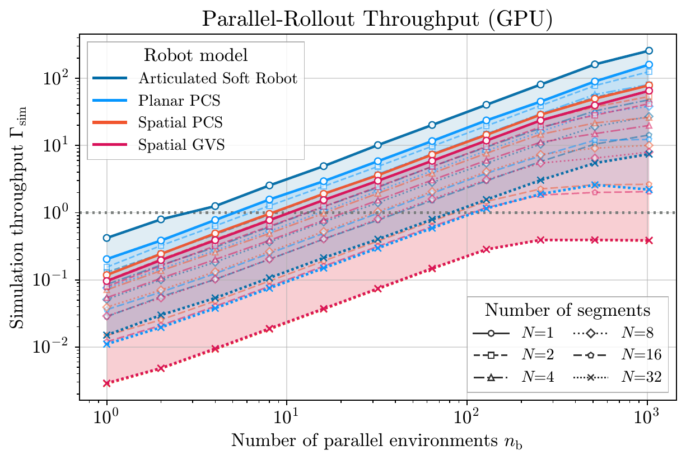
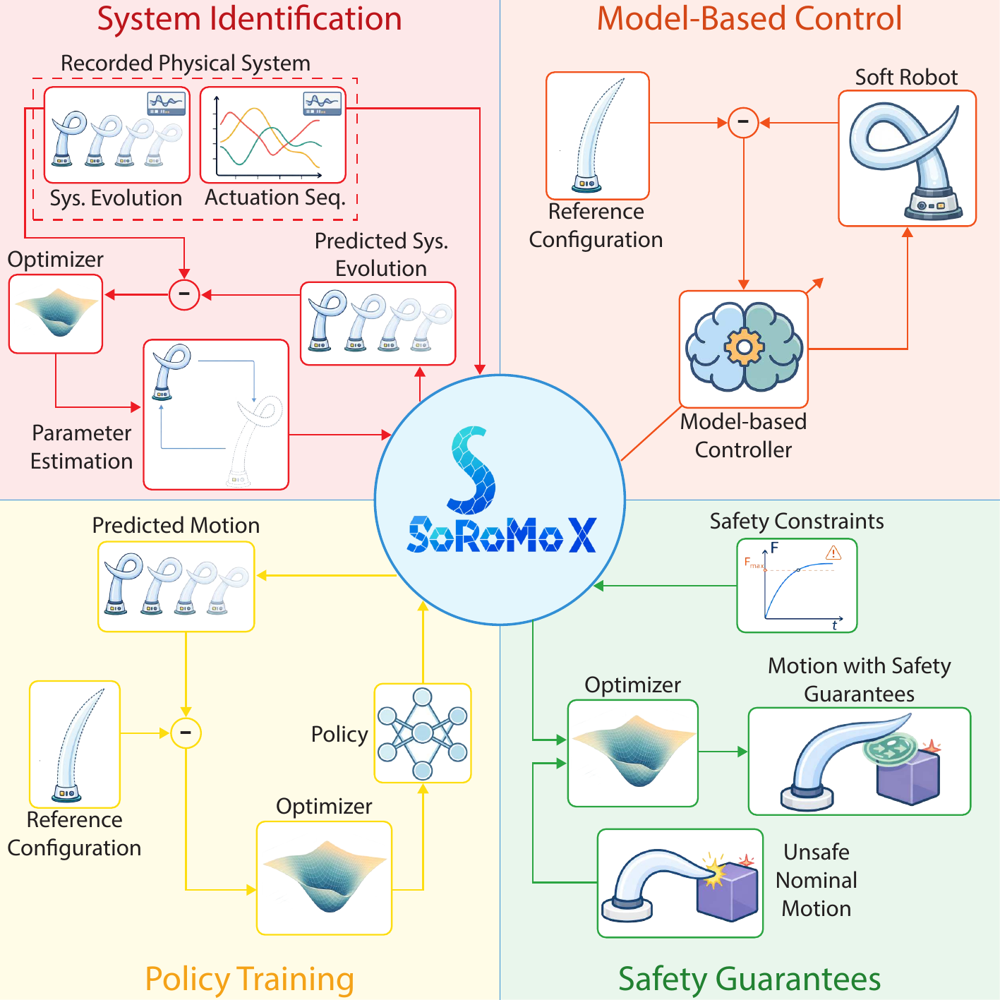
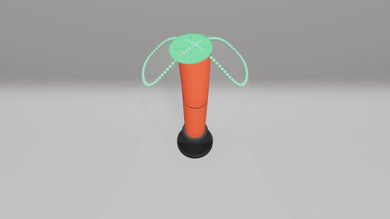
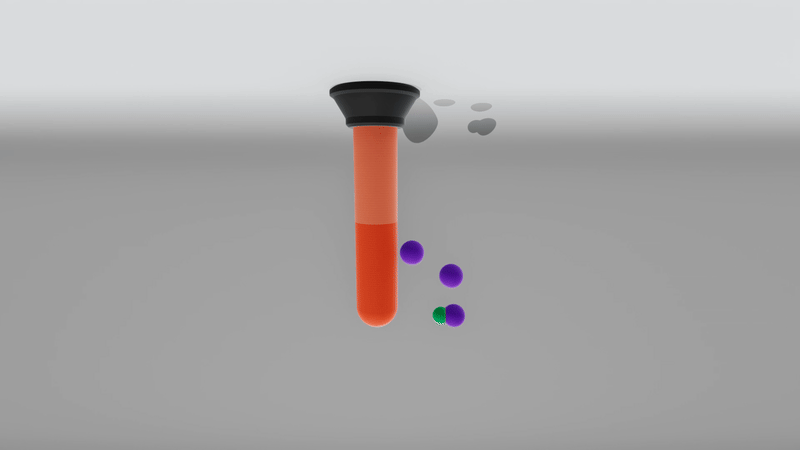
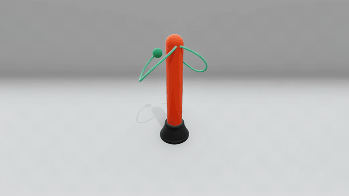

<div align="center">
  

  # Soft Robot Models in jaX (SoRoMoX)
</div>

<div align="center">

[](https://github.com/tud-phi/soromox/actions/workflows/test.yml)
[](https://pypi.org/project/soromox/)
[](https://arxiv.org/abs/2608.06650)
[](https://www.python.org/downloads/)
[](https://github.com/tud-phi/soromox/blob/main/LICENSE.txt)
[](https://tud-phi.github.io/soromox/)

</div>

SoRoMoX is a fully numerical, JIT-compilable Python/JAX implementation of
control-oriented models for articulated and continuum soft robots. It provides
articulated soft-robot, piecewise-constant strain (PCS), and geometric variable
strain (GVS) models through a common interface for kinematics, dynamics,
energies, Jacobians and derivatives, and forward dynamics. Because the
numerical core is JAX-native, these model computations can be JIT-compiled,
automatically differentiated with respect to states, inputs, and physical
parameters, batched, and executed on CPUs, GPUs, and TPUs.

<p align="center">
  
</p>

Model-based controllers and rendering backends complement the core model
implementations. The accompanying paper benchmarks the numerical stack and
uses six application case studies to demonstrate differentiability,
parallelization, and the control-oriented model interface.

> **Note:** SoRoMoX succeeds
> [JSRM](https://github.com/tud-phi/jax-soft-robot-modeling), replacing symbolic
> derivations with scalable numerical implementations and extending the model
> families and common interfaces.

## Models and numerical interface

- **Soft robot model implementations:** articulated soft-robot, PCS, and GVS
  formulations implemented numerically in Python/JAX.
- **JAX-native execution:** JIT compilation, automatic differentiation with
  respect to states, inputs, and parameters, vectorization with `vmap`, and
  CPU/GPU/TPU execution.
- **Control-oriented quantities:** backbone kinematics, Jacobians and their
  derivatives, inertia matrices, Coriolis, gravitational, elastic, and damping
  terms, energies, actuation maps, and forward dynamics.
- **Composable actuation and systems:** generalized-coordinate/strain,
  threadlike, McKibben, and functional-metamaterial actuation across planar and
  spatial examples.
- **Model-based control implementations:** configuration-, operational-, and
  actuation-space controllers, including potential compensation,
  computed-torque, and impedance controllers.
- **Rendering:** Matplotlib, Open3D, Viser, and OpenCV backends for static,
  interactive, real-time, and recorded visualizations.

Following the model organization in Table II of the paper:

| Model family | Planar implementation | Actuation modalities | Example instantiations |
| --- | --- | --- | --- |
| Articulated soft robot | [Soft pendulum](https://github.com/tud-phi/soromox/tree/main/examples/simulation/pendulum) | Generalized-coordinate (joint-torque), articulated-tendon, and McKibben actuation | [UMArm](https://tud-phi.github.io/soromox/api/systems/articulated/mckibben-umarm/) |
| Piecewise constant strain (PCS) | [Planar PCS](https://github.com/tud-phi/soromox/blob/main/examples/simulation/pcs/simulate_planar_pcs.py) | Generalized-strain, threadlike, and functional-metamaterial (HSA) actuation | [I-SUPPORT](https://tud-phi.github.io/soromox/api/systems/pcs/isupport/) and [planar HSA](https://tud-phi.github.io/soromox/api/systems/hsa/planar-hsa/) |
| Geometric variable strain (GVS) | — | Generalized-coordinate and threadlike actuation | [Tapered cable-driven soft tentacle](https://github.com/tud-phi/soromox/blob/main/examples/simulation/gvs/simulate_tendon_actuated_gvs.py) |

## Installation

Install the core package from PyPI:

```bash
python -m pip install soromox
```

With [uv](https://docs.astral.sh/uv/):

```bash
uv pip install soromox
```

Optional extras add the dependencies needed for a workflow:

```bash
python -m pip install "soromox[rendering]"     # all rendering backends
python -m pip install "soromox[examples]"      # runnable examples
python -m pip install "soromox[rl]"            # reinforcement learning examples
python -m pip install "soromox[paper_results]" # paper reproduction workflows
```

For an editable source installation:

```bash
git clone https://github.com/tud-phi/soromox.git
cd soromox
python -m pip install -e .
```

Contributors can add development extras with
`python -m pip install -e ".[dev,docs,examples]"`; see
[CONTRIBUTING.md](https://github.com/tud-phi/soromox/blob/main/CONTRIBUTING.md)
for tests and tooling.

## Quick start

Run a simulation from the example catalogue:

```bash
python examples/simulation/pendulum/simulate_pendulum.py
python examples/simulation/pcs/simulate_planar_pcs.py
```

The [Quick Start](https://tud-phi.github.io/soromox/user-guide/quick-start/)
introduces model construction, simulation, control, and rendering. The
[examples catalogue](https://tud-phi.github.io/soromox/user-guide/examples/)
maps complete scripts to the supported models and workflows.

## Performance

For the paper's sequential CPU rollouts, SoRoMoX is up to 18.1× faster than
SoRoSim in matched PCS and GVS cases:

| Formulation | Case | SoRoSim (s) | SoRoMoX (s) | Speedup |
| --- | --- | ---: | ---: | ---: |
| FEM/PCS | Planar | 75.73 | 4.18 | 18.1× |
| FEM/PCS | Spatial | 78.65 | 13.26 | 5.9× |
| FEM/GVS | Spatial | 55.54 | 36.33 | 1.5× |
| FEM/GVS | Tendons | 75.80 | 36.47 | 2.1× |

<p align="center">
  
</p>

On the paper's RTX 5090 benchmark, increasing the leading batch size from 1 to
256 yields up to 234.6× higher simulation throughput. See
[Paper & Results](https://tud-phi.github.io/soromox/research/) for the full
benchmark context and reproduction pointers.

## Application case studies

The paper's six application case studies demonstrate how the model layer can
support parameter identification, residual learning, model-based control,
controller gain optimization, safety-constrained control, and parallel
reinforcement learning.

<p align="center">
  
</p>

### Operational-space model-based control

<p align="center">
  
</p>

### Safety-constrained control

<p align="center">
  
</p>

### Parallel reinforcement learning

<p align="center">
  
</p>

See all six studies on the
[Paper & Results](https://tud-phi.github.io/soromox/research/) page.

## Documentation

- [Documentation home](https://tud-phi.github.io/soromox/)
- [Installation guide](https://tud-phi.github.io/soromox/installation/)
- [Quick Start](https://tud-phi.github.io/soromox/user-guide/quick-start/)
- [API reference](https://tud-phi.github.io/soromox/api/overview/)
- [Rendering guide and gallery](https://tud-phi.github.io/soromox/api/rendering/)
- [Paper & Results](https://tud-phi.github.io/soromox/research/)
- [Citation guidance](https://tud-phi.github.io/soromox/citation/)

## Citation

If you use SoRoMoX in academic work, please cite the associated preprint:

```bibtex
@misc{stolzle2026soromox,
  title = {{SoRoMoX}: Fast, Differentiable, and Parallelizable Soft Robot Models},
  author = {Maximilian St{\"o}lzle and Solange Gribonval and Daniel {Feliu-Talegon} and Vito Daniele Perfetta and Michele Martini and Chuhan Zhang and Kiwan Wong and Mohammed Tarnini and Anup Teejo Mathew and Federico Renda and Daniela Rus and Cosimo {Della Santina}},
  year = {2026},
  eprint = {2608.06650},
  archivePrefix = {arXiv},
  primaryClass = {cs.RO},
  doi = {10.48550/arXiv.2608.06650},
  url = {https://arxiv.org/abs/2608.06650},
}
```

For reproducible computational work, also report `soromox.__version__`.
The [full citation guide](https://tud-phi.github.io/soromox/citation/)
contains exact-version software citations and model- or controller-specific
references.

## Contributing and license

Contributions are welcome; start with
[CONTRIBUTING.md](https://github.com/tud-phi/soromox/blob/main/CONTRIBUTING.md).
SoRoMoX is distributed under the
[MIT License](https://github.com/tud-phi/soromox/blob/main/LICENSE.txt).
