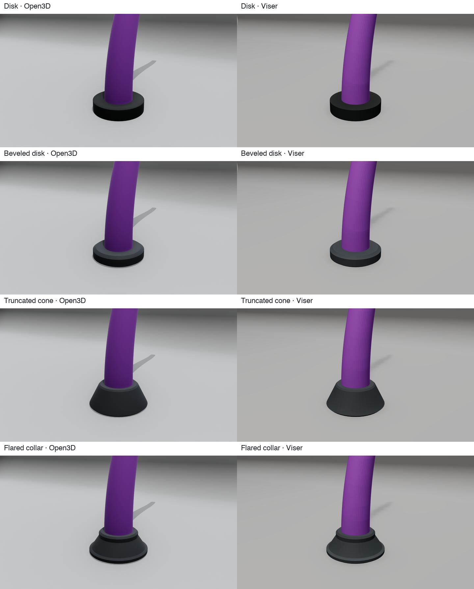

# Shared Renderer Configuration

`RendererConfig` groups settings into five sections: scene, camera, colors,
geometry and output. Start with a scene preset, then adjust the sections needed
for your visualization. Compare the presets in the [preset gallery](presets.md).

## RendererConfig

Every renderer accepts `config=RendererConfig(...)`. The renderer copies and
validates the supplied configuration at construction. Preset results are editable;
configure them before creating the renderer. Independent defaults use 800 × 600
pixels, 80 backbone samples and 48 cross-section samples.

```python
from soromox.rendering import (
    RendererConfig, SceneConfig, GeometryConfig, RenderOutputConfig, ViserRenderer,
)

config = RendererConfig(
    scene=SceneConfig.studio("neutral", scene_extent=1.2),
    geometry=GeometryConfig(num_points=100, cross_section_resolution=64),
    output=RenderOutputConfig(width=1920, height=1080),
)
config.scene.material.roughness = 0.8
renderer = ViserRenderer(robot, config=config, port=8080)
```

The sections are `scene`, `camera`, `colors`, `geometry` and `output`.
Backend controls, such as the Viser server port, are constructor arguments.
Trajectories, placement offsets, recording paths and playback controls belong to
rendering operations. Per-call `camera_config`, `color_config` and `video_config`
replace the corresponding complete default section without modifying it.

## Scene configuration

### Presets

| Factory | Appearance |
| --- | --- |
| `SceneConfig.technical()` | White background, shaded objects and a grid without a filled surface |
| `SceneConfig.studio("neutral")` | Grey curved backdrop, balanced key and fill |
| `SceneConfig.studio("bright")` | Bright backdrop and gentle grounding shadows |
| `SceneConfig.studio("dark")` | Charcoal background with frontal key, fill and rim lighting |
| `SceneConfig.flat()` | Unlit colors on white, without ground or shadows |
| `RendererConfig.clay(color=(0.72, 0.65, 0.56))` | Uniform matte robot colors and studio lighting |

Clay overrides backbone, base and actuator colors. Helper objects retain their
semantic colors. Studio presets preserve the supplied robot palette.

### Lighting and materials

Directional lights use `illuminance_lux`; point lights use `intensity_candela`
and world positions in metres. `PointLightConfig.from_lumens(flux)` divides
isotropic flux by `4*pi`. Open3D converts candela back to lumens. Ambient
illumination uses relative strength: Open3D uses its environment map, and Viser
approximates it with a world-up hemisphere light. Preset `scene_extent` scales point positions
linearly and intensities quadratically; explicit light settings are never resized
during camera fitting or playback. Public colors are sRGB.


`config.scene.material` controls lit/unlit or toon shading, roughness, metallicity,
reflectance, opacity, face normals and wireframe. `config.scene.shadows` and
`config.scene.ambient_occlusion` enable shadow and occlusion effects where supported.

### Robot base

Robot poses come from the model's fixed base or floating runtime coordinates.
Open3D and Viser support four circular mounting shapes through
`config.geometry.base_plate_style`: `"disk"`, `"beveled_disk"`,
`"truncated_cone"` and `"flared_collar"` (the default). The flared collar has
a lower flange, tapered body and upper rim; the beveled disk provides a smaller
visual accent. Matplotlib uses a simple filled disk in 3D and a transverse marker in 2D,
independently of the selected mount style. OpenCV uses its planar base marker.

`base_plate_radius_scale` multiplies the proximal cross-section's maximum radial
extent: the circle radius, larger ellipse semi-axis, or rectangle half-diagonal.
The default multiplier is 2.0. `base_plate_thickness` specifies the total mount
height in metres (default 0.06), independently of the radius. The mount extends
behind the robot's proximal point along its base axis.

```python
config.geometry.base_plate_style = "flared_collar"
config.geometry.base_plate_radius_scale = 2.0
config.geometry.base_plate_thickness = 0.024
```



The disk and beveled disk above use a 28 mm radius and 12 mm height; the cone
and collar use a 32 mm radius and 24 mm height. Each style can use either size.

### Ground plane and backdrop

The independent `config.scene.ground` describes the floor:

```python
from soromox.rendering import GroundPlaneConfig

config.scene.ground = GroundPlaneConfig(
    visible=True, surface=True, alignment="world", height=0.0,
    height_reference="world", size=1.2,
    color=(0.85, 0.85, 0.85), opacity=1.0,
    grid=True, grid_spacing=0.1, grid_major_every=5, receive_shadow=True,
)
```

The technical default uses `surface=False`: a grid without a filled slab.
`surface=True` adds a shadow-receiving plane. Grid spacing is fixed in metres,
anchored to the world origin and shared between backends. Automatic spacing
selects a 1/2/5 decimal step; `grid_major_every` and `grid_major_color` control
the major lines. Planar renderers show this reference as a line.

A world floor uses +Z for spatial robots and +Y for planar robots. `normal`
selects an explicit world normal; `height` is measured along the selected
reference in metres. The default `height_reference="world"` keeps the current
world-origin height behavior. `height_reference="base_mounting_face"` uses the
configured base plate thickness and the current robot base position, so
`height=0` places a world-aligned floor at the mounting face of the base plate. A
world-aligned base-referenced floor requires all robot bases to share one
height; `alignment="base"` creates one plane per robot when they do not. Base
alignment already anchors each plane at its corresponding base mounting face, and
`height` offsets that plane along the base normal.
The `base_mounting_face` reference requires a fixed base; selecting it for a
floating-base robot raises `ValueError`. It also requires every fixed base axis
to be parallel or antiparallel to the floor normal: +Z shifts the floor down by
the plate thickness, while -Z shifts it up by the same amount.

The existing `normal` field represents the ground direction, so spatial z-up
and z-down planes are selected with `normal=(0, 0, 1)` and `normal=(0, 0, -1)`.
For a hanging composition, rotate the camera position and look-at with the
mounting orientation and keep camera up at +z. The gallery provides this as
`--mounting hanging`, preserving the curved studio surface above the robot.

```python
scene = SceneConfig.studio(
    ground=GroundPlaneConfig(height_reference="base_mounting_face")
)
```

Automatic sizing fits the whole robot trajectory and helper bounds. Scenery is
excluded from camera fitting. Live visualization retains its initial bounds. A
curved backdrop uses the same resolved floor height.

`BackdropConfig.radius` controls the bend's horizontal reach;
`vertical_radius` controls its height and defaults to the same value.
`curvature_easing` ranges from 0 (an elliptical arc) to 1 (a curve that gradually
flattens into the floor and wall). `wall_offset` places the start of the bend
behind the scene center. These dimensions are multiples of the fitted scene extent.

The studio and clay presets use a low, gradually curved transition:

```python
scene = SceneConfig.studio()
scene.backdrop.radius = 0.40
scene.backdrop.vertical_radius = 0.23
scene.backdrop.wall_offset = 0.02
scene.backdrop.curvature_easing = 0.80
```

Its key light illuminates both the floor and wall, with ambient illumination and
point fills reducing the contrast across the bend. Bright and dark retain their
distinct lighting settings. Clay uses neutral studio lighting with an additional
cool rim light and a uniform matte robot material.

## Camera configuration

The `CameraConfig` class provides unified camera configuration across renderers (Matplotlib, Open3D, Viser).

```python
from soromox.rendering import CameraConfig

camera = CameraConfig(
    fov=60.0,                           # Field of view in degrees
    position=(0.6, -0.6, 0.4),          # Camera position (x, y, z)
    look_at=(0.0, 0.0, 0.1),            # Point camera looks at
    up=(0.0, 0.0, 1.0),                 # Camera up vector (default: Z-up)
    distance_factor=2.0,                # Multiplier for auto-positioning
)

renderer.show(q, camera_config=camera)
```

### Camera parameters

| Parameter | Type | Default | Description |
|-----------|------|---------|-------------|
| `fov` | float | 75.0 | Field of view in degrees |
| `exposure_ev100` | float | 15.0 | Exposure value at ISO 100, approximated through illumination gain |
| `position` | tuple | None | Explicit camera position (x, y, z), None for auto |
| `look_at` | tuple | None | Point camera looks at, None for scene center |
| `up` | tuple | (0, 0, 1) | Camera up vector |
| `distance_factor` | float | 1.5 | Multiplier for auto-positioning distance |
| `position_offset` | tuple | (0.8, -0.8, 0.5) | Direction vector for camera placement |

Matplotlib applies `fov` and the viewing direction from `position` to
`look_at`; its axes limits determine the remaining framing. Open3D and Viser
also use the explicit camera distance.

### Exposure and tone mapping

`CameraConfig.exposure_ev100` defaults to 15. Increasing it by one halves light
strength in the modern Open3D adapter and the Viser approximation. This scales
illumination because their public APIs do not expose a shared photographic camera
exposure control. It does not simulate aperture, shutter blur or depth of field.
Choose `scene.tone_mapping="backend-default"`, `"linear"` or `"aces"`.
The patched Open3D build uses Filament’s Filmic mapper for `backend-default`,
preserving neutral highlights, and supports explicit linear and ACES selection.
The technical preset selects linear mapping to retain a white background; studio
presets use the default Filmic mapping. Older builds warn when this support is unavailable. The flat unlit path bypasses
post-processing. Viser uses its browser tone mapper.

## Color configuration

### Color Hierarchy

Colors are configured via `RendererColorConfig` + `BackboneColorConfig` and resolved using a consistent hierarchy. More specific inputs override less specific ones:

```
robot_palette → segment_palette → point_palette
robot_colors → segment_colors → point_colors
robot_segment_colors → robot_point_colors
```

Alpha values in per-robot colors propagate to more specific colors when those omit alpha.

### RendererColorConfig

Main color configuration container for all renderers.

```python
from soromox.rendering import ActuatorStyleConfig, BackboneColorConfig, RendererColorConfig

color_config = RendererColorConfig(
    backbone=BackboneColorConfig(
        robot_palette="viridis",
        segment_palette="soromox:ember",
    ),
    base_plate_color=(0.5, 0.5, 0.5),
    actuators=ActuatorStyleConfig(
        default_color=(0.8, 0.2, 0.2),
        kind_colors={"tendon": (0.85, 0.2, 0.15)},
        kind_radii={"tendon": 5e-4},
    ),
)

renderer.show(q, color_config=color_config)
```


### BackboneColorConfig

Backbone-specific color configuration with palette and explicit color support.

```python
from soromox.rendering import BackboneColorConfig

backbone_config = BackboneColorConfig(
    robot_palette="plasma",                    # Colormap for multiple robots
    segment_palette="soromox:ember",           # Per-segment colors
    robot_colors=[(0.2, 0.6, 0.9, 0.5)],       # Explicit robot colors with alpha
)
```


### Built-in palettes and themes

#### Available palettes

SoRoMoX includes publication-friendly color palettes:

| Palette | Description |
|---------|-------------|
| `soromox:okabe-ito` | Colorblind-friendly palette |
| `soromox:tol-bright` | Paul Tol's bright qualitative palette |
| `soromox:tol-muted` | Paul Tol's muted qualitative palette |
| `soromox:ember` | Warm gradient (orange to red) |
| `soromox:glacier` | Cool gradient (blue to cyan) |
| `soromox:slate` | Neutral gray gradient |

You can also use any Matplotlib colormap name (e.g., `"viridis"`, `"plasma"`, `"coolwarm"`).

```python
from soromox.rendering import list_builtin_palettes

print(list_builtin_palettes())
```

#### Color themes

Pre-configured themes for consistent styling:

```python
from soromox.rendering import get_color_theme, list_builtin_themes

# List available themes
print(list_builtin_themes())

# Use a theme
theme = get_color_theme("soromox:paper")
renderer = ViserRenderer(robot, config=RendererConfig(colors=theme))
```


### Color shape reference

When providing explicit colors, use these shapes:

| Parameter | Shape | Description |
|-----------|-------|-------------|
| `robot_colors` | (N, 3/4) | Per-robot colors (RGB or RGBA) |
| `segment_colors` | (S, 3/4) | Per-segment colors |
| `point_colors` | (P, 3/4) | Per-backbone-point colors |
| `robot_segment_colors` | (N, S, 3/4) | Per-robot, per-segment colors |
| `robot_point_colors` | (N, P, 3/4) | Per-robot, per-point colors |


### Color legend

For creating legends in plots:

```python
legend = renderer.get_color_legend(num_robots=3, color_config=color_config)
# Returns ColorLegend with robot labels and colors
```

## Geometry and multi-robot layouts

`config.geometry` sets backbone and cross-section sample counts, swept or discrete
geometry, base plate dimensions, line widths and automatic robot spacing. Base
poses and runtime configurations determine the robot geometry; scene settings
only control its display. Increase sample counts for smoother exported surfaces.

Matplotlib, Open3D, and Viser accept batched robot configurations:

- `q` with shape `(N, DOF)` for `show()` and `render_frame()`;
- `q_ts` with shape `(N, T, DOF)` for sequence rendering or animation.

Use `base_offsets` to place each robot explicitly or `config.geometry.grid_spacing` to control
automatically generated layouts. Viser additionally supports
`multi_robot_layout="overlay"` to render robots at a common base pose. Per-robot
colors and alpha values can distinguish overlaid configurations.

Open3D automatically merges each robot's backbone primitives into one dynamic
mesh when an interactive scene contains multiple robots. This removes most backend
geometry registrations; set `merge_backbone_meshes=True` to force merging for
one robot or `False` to disable it for profiling or compatibility. Viser uses
instanced or color-grouped meshes for animation and PBR meshes for static output.
Automatically sized ground planes use the complete trajectory and helper bounds.

```python
renderer.render_sequence(
    ts,
    q_ts_batched,
    multi_robot_layout="overlay",
    color_config=color_config,
)
```

## Output and recording

`RenderOutputConfig` selects image dimensions and default video encoding:

```python
from soromox.rendering import RenderOutputConfig, VideoEncodingConfig

config.output = RenderOutputConfig(
    width=1920, height=1080,
    video=VideoEncodingConfig(codec="libx264", crf=18, pix_fmt="yuv420p"),
)
```

Set this before constructing the renderer. A per-call `video_config` replaces
`config.output.video` for that operation. Supply `record_path` to
`render_sequence()` to export a video or, where supported, an image sequence.
Open3D export is synchronous; a sequence without a recording path opens animated
playback. See the [renderer API](renderers.md) for backend-specific operations.

## Backend support

Unsupported requested features produce one warning per renderer and mode.

| Backend/mode | Supported appearance | Approximation or omission |
| --- | --- | --- |
| Modern Open3D: image, video, static `show()` | PBR material, explicit lights, floor/backdrop, shadows, AO | Exposure through light scaling; older builds may ignore tone-map selection; ambient tint, toon, face-normal and wireframe settings approximated |
| Legacy Open3D animation | Efficient geometry updates, colors, floor/backdrop, basic lit/unlit shading | PBR lighting, opacity, shadows, AO and exposure differ from modern output |
| Viser static | PBR GLB meshes, unlit materials, explicit lights, floor/backdrop, cast shadows | Lux/candela calibrated to browser intensity; fixed browser tone mapping can shift unlit colors; no AO or custom dielectric reflectance |
| Viser playback/live | Efficient mesh updates, colors, lights, floor/backdrop, shadows | Roughness/metallicity and unlit materials approximated by the editable mesh shader |
| Matplotlib | Robot colors, line geometry, viewing direction, white background and standard axes | Scene appearance, ground planes, backdrops, materials, lighting, shadows, AO and exposure ignored |
| OpenCV planar/HSA | BGR output, sRGB robot colors, line geometry and white background | Scene appearance, ground planes, backdrops, materials, lighting, shadows, AO and camera settings ignored |

On the tested macOS development build, opening a legacy OpenGL preview after a
modern Metal GUI window can crash upstream GLFW. SoRoMoX rejects that transition
with a clear error; launch the animated preview in a fresh Python process.
Modern image and video exports and static windows are available independently.

Physical light units do not imply identical images: environment illumination,
material models, tone mapping and shadow algorithms differ. Filament supports one dominant directional light; additional directional lights
produce a warning. Presets use one directional key plus point lights for fill
and rim illumination; they do not reproduce area-light reflections,
subsurface scattering or reference-image compositing.

See the [preset comparison gallery](presets.md) for
actual tentacle renders, references and backend differences.

## Configuration API

All public settings are available from `soromox.rendering.config` and re-exported
from `soromox.rendering`. Their implementation is organized by responsibility:

| Module | Contents |
| --- | --- |
| `config.scene` | Scene presets, lights, materials, ground planes and backdrops |
| `config.camera` | Camera position, orientation and exposure |
| `config.colors` | Robot/actuator colors, palettes and color resolution |
| `config.output` | Image dimensions and video encoding settings |
| `config.renderer` | Composed renderer settings, geometry sampling and validation |

`base.py` implements shared rendering behavior. Backend scene handles and
recording state stay with their renderers; `video_encoding.py` implements the
FFmpeg writer.

::: soromox.rendering.config
    options:
      show_root_heading: true
      show_source: false
      heading_level: 3
      docstring_section_style: table

### Light orientation for hanging scenes

Preset directional and point lights use `reference="ground"`, resolving their
vectors through the same basis as the backdrop. `GroundPlaneConfig(normal=(0, 0, -1))`
rotates that basis by 180 degrees about world Y. Custom lights default to
`reference="world"`, preserving explicit world positions and directions. Ground-relative
point positions are measured from the world origin; ground height does not translate
them. Preset intensity and range retain the existing `scene_extent` scaling.

The gallery's `--mounting hanging` also rotates robot placement and camera position,
while retaining camera up at +z for an upside-down composition. Merely changing the
camera up vector rolls the image; it does not change the robot's world mounting or
the ground normal. Open3D's fixed environment map may produce ambient shading
differences between mounting orientations.
