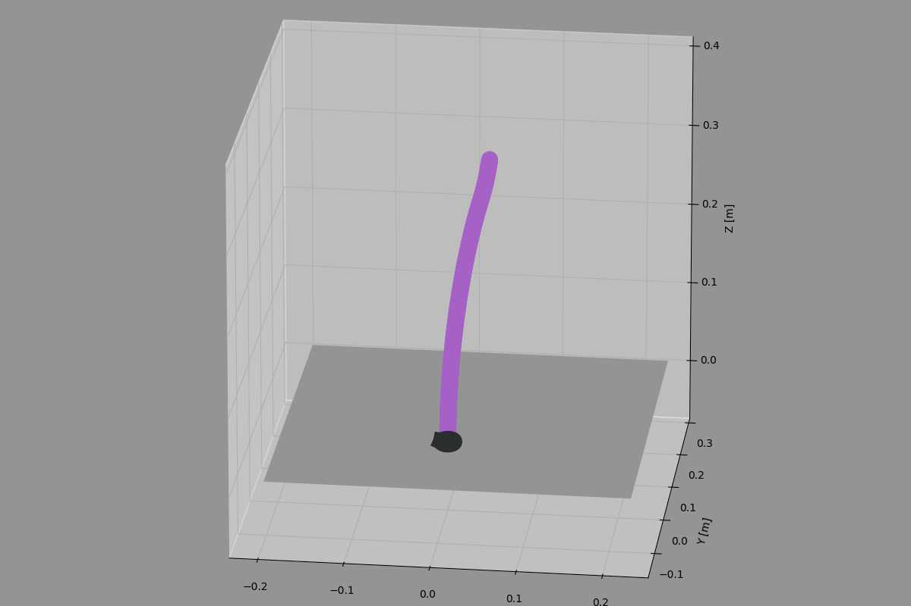
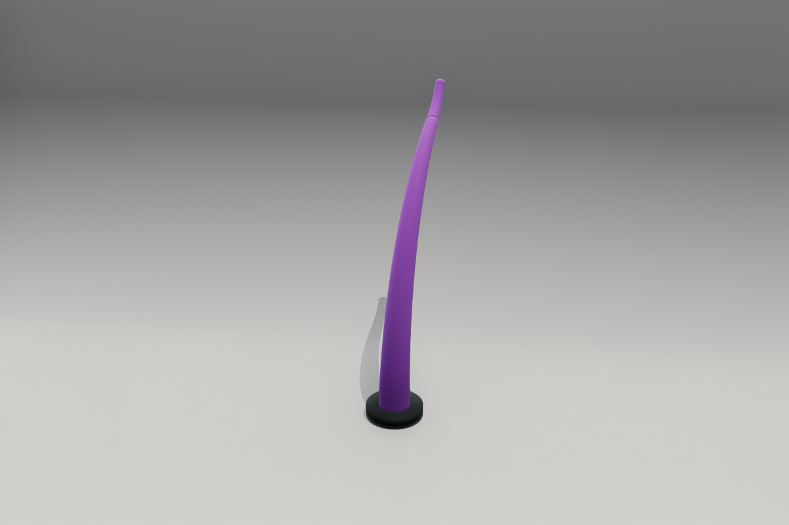
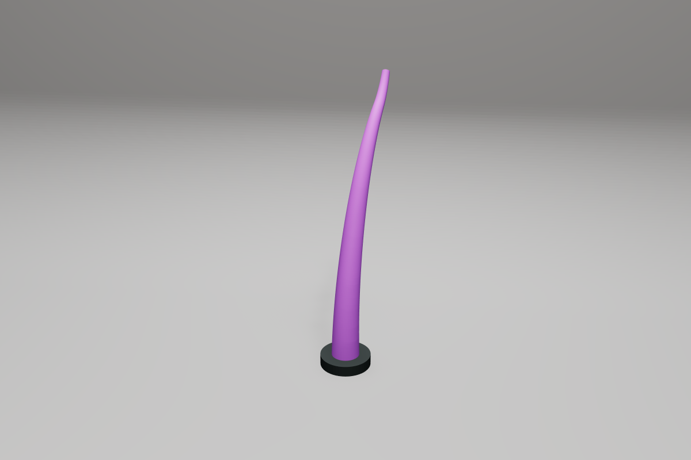
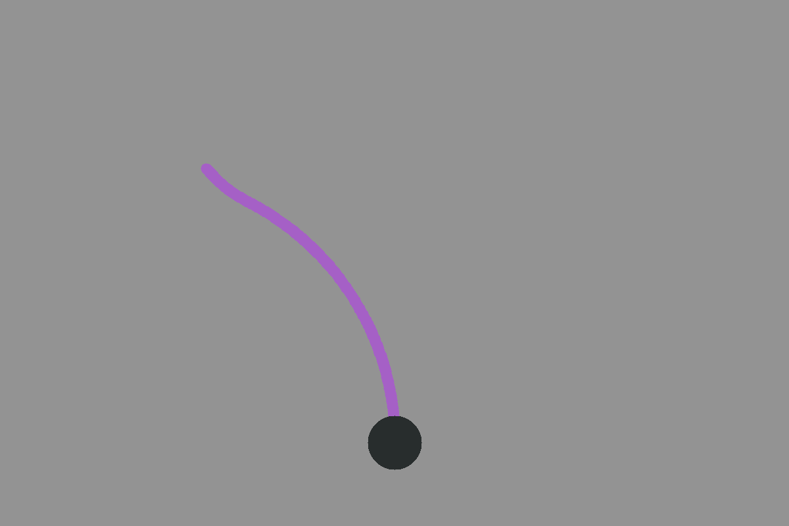

# Rendering

Visualization and rendering utilities for soft robot systems.

The rendering module provides a class-based architecture for visualizing soft robots. All renderers inherit from a common base class `BaseSoftRobotRenderer` which provides cached forward kinematics and a unified interface.

## Core renderer gallery

The Matplotlib, Open3D, and Viser samples show the same upright tapered GVS
tentacle with `SceneConfig.studio()` (the neutral studio variant), a pastel
purple backbone and a dark base. OpenCV shows a two-link planar PCS counterpart
with the same lengths and prescribed bending coordinates. Matplotlib and OpenCV
apply background, ground and color settings while approximating studio lighting
and backdrop geometry.

The [preset gallery](presets.md) compares all six scene presets in Open3D and
Viser. These examples select neutral studio explicitly; the renderer-wide default
is the technical preset.

<div class="grid cards soromox-gallery" markdown>

-   **Matplotlib**

    

    Polished static figures and notebook-friendly inspection for planar and
    spatial robots.

    [Matplotlib renderer details](renderers.md#matplotlib-renderer)

-   **Open3D**

    

    Interactive spatial inspection with geometry, camera control, and offline
    frame or video capture.

    [Open3D renderer details](renderers.md#open3d-renderer)

-   **Viser**

    

    Browser-based 3D visualization for live demos, playback, and multi-robot
    scenes.

    [Viser renderer details](renderers.md#viser-renderer)

-   **OpenCV Planar**

    

    Lightweight real-time planar frames and fast video export.

    [OpenCV Planar renderer details](renderers.md#opencv-planar-renderer)

</div>

Reproduce these images with `examples/rendering/backend_gallery.py --backend`
followed by `matplotlib`, `open3d`, `viser` or `opencv`.

System-specific renderer designs are documented alongside their robots: the
[Planar HSA OpenCV renderer](../systems/pcs/planar-hsa.md),
[I-SUPPORT Viser renderer](../systems/pcs/isupport.md), and
[UMArm Viser renderer](../systems/articulated/mckibben-umarm.md).

## Choosing a Renderer

| Renderer | Best For | Strengths | Limitations |
|----------|----------|-----------|-------------|
| `MatplotlibRenderer` | Static plots, notebooks, debugging | Works with any robot, easy to embed | Limited interactivity, slower animations |
| `Open3DRenderer` | Interactive 3D inspection | Rich camera controls, headless capture | Requires Open3D, 3D only |
| `ViserRenderer` | Live demos, web-based visualization | Browser UI, live streaming, multi-robot | Requires web server, 3D only |
| `OpenCVPlanarRenderer` | Fast 2D animations, video export | Lightweight, fast output | Planar robots only |
| `OpenCVPlanarHSARenderer` | PlanarHSA-specific visuals | HSA-specific geometry | PlanarHSA only |

## Documentation

### [Renderer API](renderers.md)

Complete API reference for all renderer classes:

- `BaseSoftRobotRenderer` - Abstract base class
- `MatplotlibRenderer` - Matplotlib-based visualization
- `Open3DRenderer` - Open3D-based 3D visualization
- `ViserRenderer` - Web-based visualization
- `OpenCVPlanarRenderer` - OpenCV-based 2D visualization
- `OpenCVPlanarHSARenderer` - HSA-specific visualization

### [Shared Configuration](configuration.md)

Settings shared by multiple renderer backends:

- `RendererConfig` - Scene, camera, colors, geometry and output settings
- Scene presets, physical light units and backend approximations
- `CameraConfig` - Camera positioning and field of view
- Robot base, base-plate, and ground-plane behavior
- Multi-robot layouts and spacing
- Recording and video encoding
- `RendererColorConfig` - Color configuration hierarchy
- `BackboneColorConfig` - Backbone-specific colors
- Built-in color palettes and themes

## Quick Start

All renderers accept a robot model at construction and expose a single-frame
entry point. For example:

```python
from soromox.rendering import RendererConfig, GeometryConfig, MatplotlibRenderer

renderer = MatplotlibRenderer(robot, config=RendererConfig(geometry=GeometryConfig(num_points=50)))
renderer.show(q)
```

Choose another backend from the table above, then follow its
[API reference](renderers.md) for interactive playback, live mode, or video
capture.
