# Renderer preset gallery

A rendering preset combines scene settings such as the background, lighting,
materials and shadows to create a consistent visual style. Presets provide
editable starting points for technical views, studio scenes and other
appearances. The images below compare these styles in Open3D and Viser using
identical soft tentacle geometry, poses and camera settings. All presets use the
default flared collar mounts; clay also applies its uniform color to the mounts.

The neutral studio is the default studio variant, selected with
`SceneConfig.studio()`. The renderer-wide default is `SceneConfig.technical()`.
See [shared configuration](configuration.md#scene-configuration) for the preset
factories and [backend support](configuration.md#backend-support) for approximations.

Generate the images from the repository root:

```bash
python examples/rendering/preset_gallery.py --backend open3d
python examples/rendering/preset_gallery.py --backend viser
```

The examples write local captures to `examples/rendering/figures/presets/`.
Reviewed gallery images are published under `docs/assets/rendering/presets/`.

## Technical

<div class="grid cards soromox-gallery soromox-preset-gallery" markdown>

-   **Open3D**

    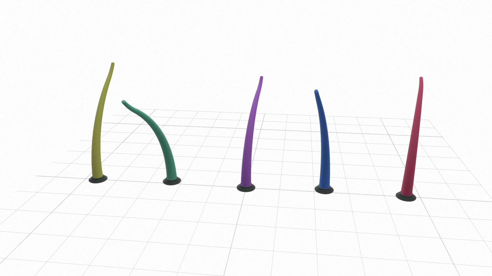

-   **Viser**

    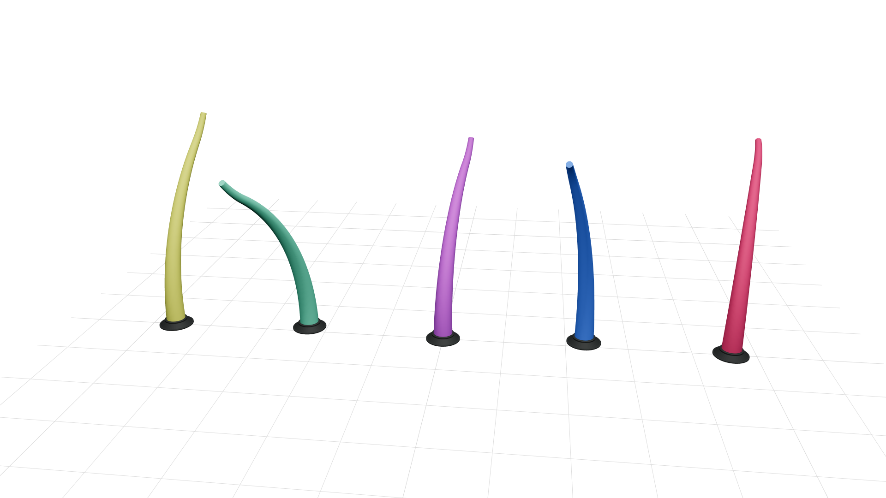

</div>

Both use a grid without a filled slab, anchored to world coordinates with major/minor lines. Balanced fill makes the supplied colors readable. Both have a white background. The technical preset requests linear tone mapping, which avoids Open3D's filmic background compression; Viser approximates this with its fixed browser transform. Open3D has softer surface shading, while Viser has stronger highlights. Workbench's outlines and cavity shading are outside this preset.

## Neutral

<div class="grid cards soromox-gallery soromox-preset-gallery" markdown>

-   **Open3D**

    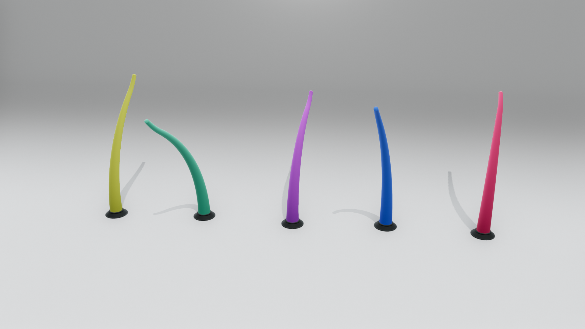

-   **Viser**

    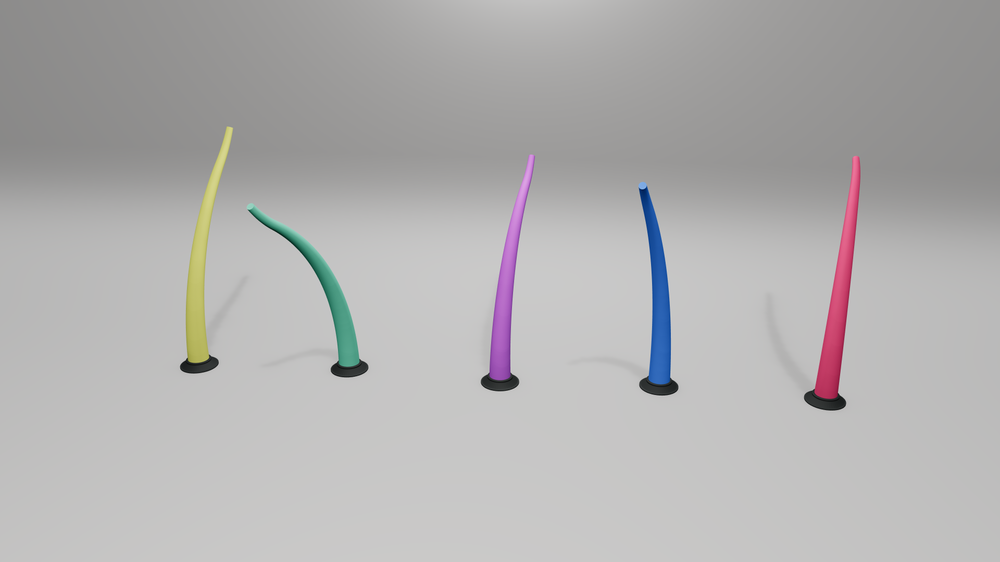

</div>

A low sweep with gradually changing curvature creates a soft, visible floor-to-wall transition. The key light illuminates both surfaces, reducing the contrast of the horizontal band. Open3D retains stronger cast shadows; Viser has a subtler background transition. The reference's reflective bands and area-light reflections are outside the matte target.

## Bright

<div class="grid cards soromox-gallery soromox-preset-gallery" markdown>

-   **Open3D**

    

-   **Viser**

    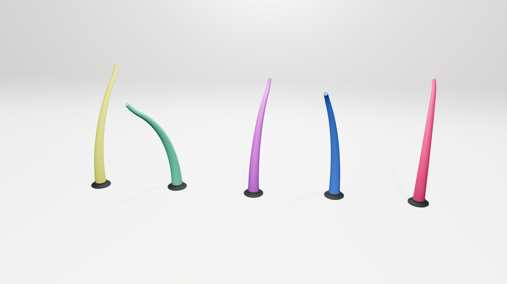

</div>

A low curved sweep adds subtle floor-to-wall separation to the bright background; gentle grounding shadows follow the stool-and-blocks reference. Both backgrounds are neutral, with a broader floor-to-wall brightness gradient in Open3D. Robot highlights retain color and shape. The reference's reflective floor is intentionally outside this matte preset.

## Dark

<div class="grid cards soromox-gallery soromox-preset-gallery" markdown>

-   **Open3D**

    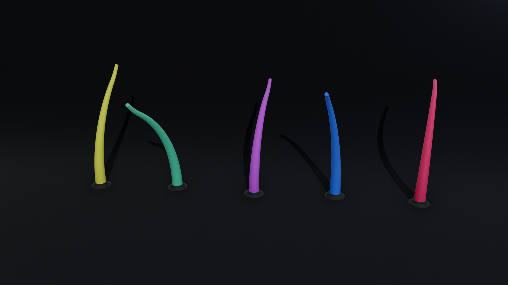

-   **Viser**

    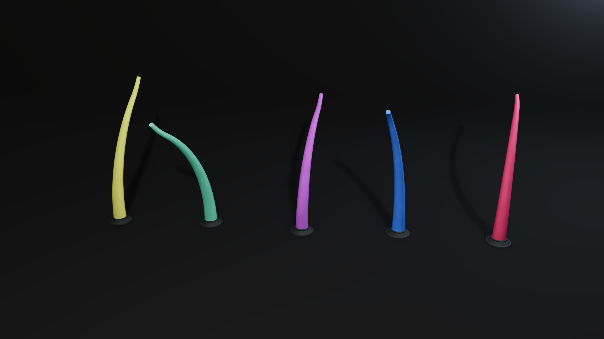

</div>

A low charcoal sweep provides floor-to-wall separation. A frontal key and fill illuminate the colored tentacle surfaces; a cool rim separates their edges. Both keep the colored tentacles readable; Open3D has softer surface gradients and more visible cast shadows. The lower key angle casts longer shadows toward the backdrop. The reference's glossy, concentrated highlight strips are broader and weaker on these matte robots.

## Flat

<div class="grid cards soromox-gallery soromox-preset-gallery" markdown>

-   **Open3D**

    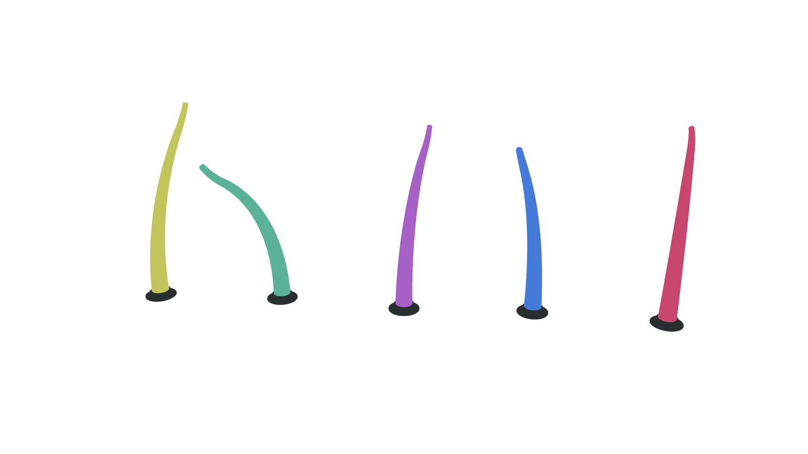

-   **Viser**

    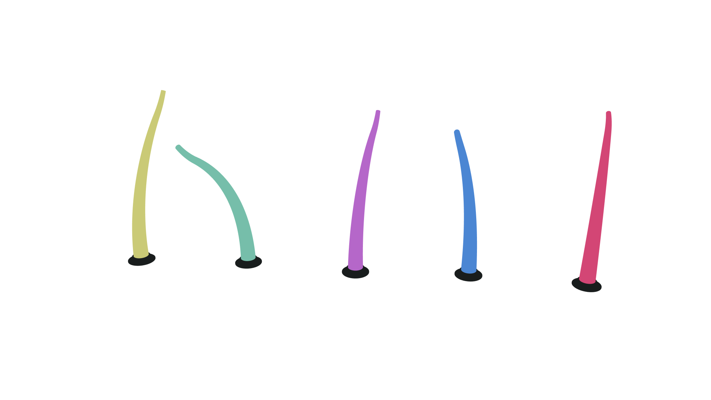

</div>

Both renders remove surface-light gradients, shadows and floor context, as in the unlit terrain reference. Open3D preserves the assigned flat colors. Viser's fixed browser tone mapping shifts their saturation and brightness; the adapter warns about this limitation. Shape is communicated by silhouette alone.

## Clay

<div class="grid cards soromox-gallery soromox-preset-gallery" markdown>

-   **Open3D**

    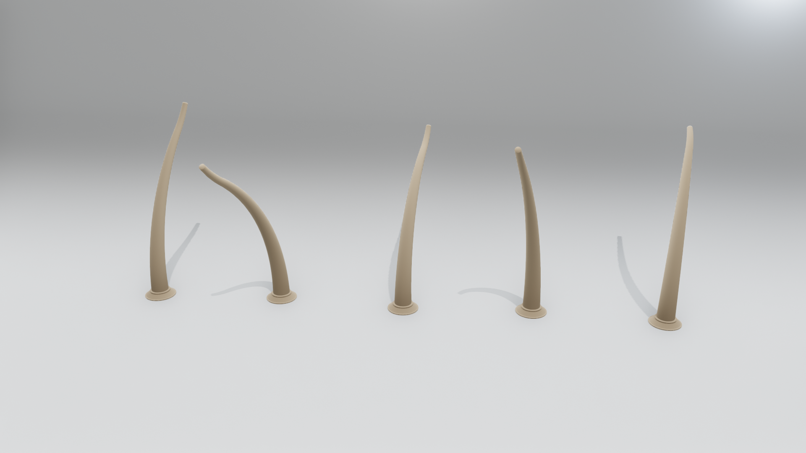

-   **Viser**

    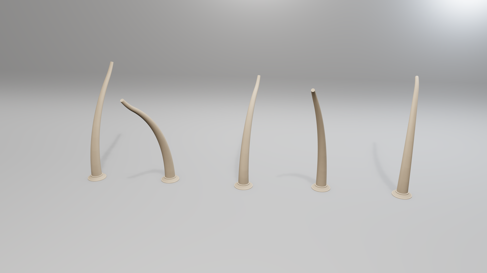

</div>

Backbones and mounts share one warm-grey matte material. The low sweep uses neutral studio lighting and an additional cool rim light, which also creates a brighter patch on the upper-right backdrop. Directional gradients and contact shadows describe form, following the clay character reference. Open3D has stronger contact definition; Viser looks smoother and lighter. Skin scattering, fine sculpted detail and compositing are not simulated.

All comparisons concern visual properties of different objects, not pixel similarity. Modern Open3D smooths matching link contours to avoid artificial shading seams; real changes in cross-section remain visible. Directional shadow maps can show bias and edge artifacts; the references often use area lights or more elaborate material and compositing treatments.

## Visual references

The presets were informed by these visual references:

- **Technical**: [Blender Workbench](https://docs.blender.org/manual/en/latest/render/workbench/index.html) · [reference image](https://docs.blender.org/manual/en/latest/_images/render_workbench_introduction_example.png)
- **Neutral**: [Render Blue — Quick Studio](https://superhivemarket.com/products/quick-studio) · [reference image](https://assets.superhivemarket.com/store/productimage/218446/image/414a253868178847f13b8ddf25e6b8e2.png)
- **Bright**: [Studio Krasht — Neutral Lighting Scene](https://studiokrasht.gumroad.com/l/zubql) · [reference image](https://public-files.gumroad.com/spsesjwr0o0fu71b7dhi866vnrbj)
- **Dark**: [GoodBread — Sharp Lights headphones](https://goodbread.co/3d-product-render-animation.html) · [reference image](https://goodbread.co/images/3d-headphones-contrasting-lights.webp)
- **Flat**: [PyVista — Lighting Properties, no lighting](https://docs.pyvista.org/examples/02-plot/lighting_mesh) · [reference image](https://docs.pyvista.org/_images/sphx_glr_lighting_mesh_002.png)
- **Clay**: [Gianluca Squillace / Marmoset — Clay Characters](https://marmoset.co/posts/rendering-high-quality-clay-characters-in-marmoset-toolbag/) · [reference image](https://marmoset.co/wp-content/uploads/2023/07/0_cover.jpg)
