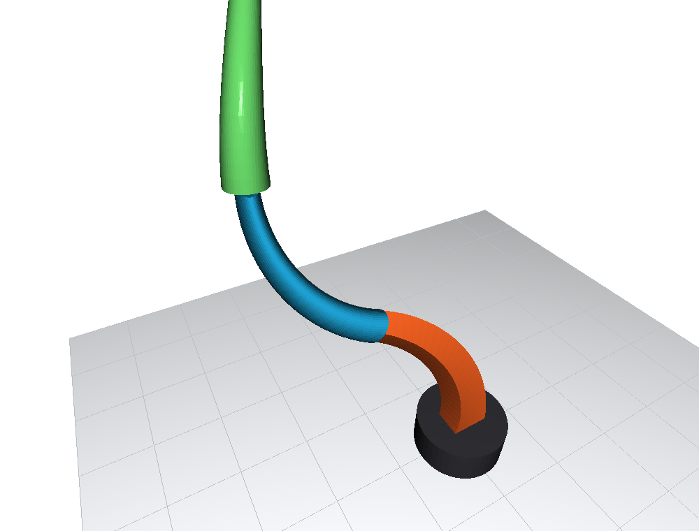
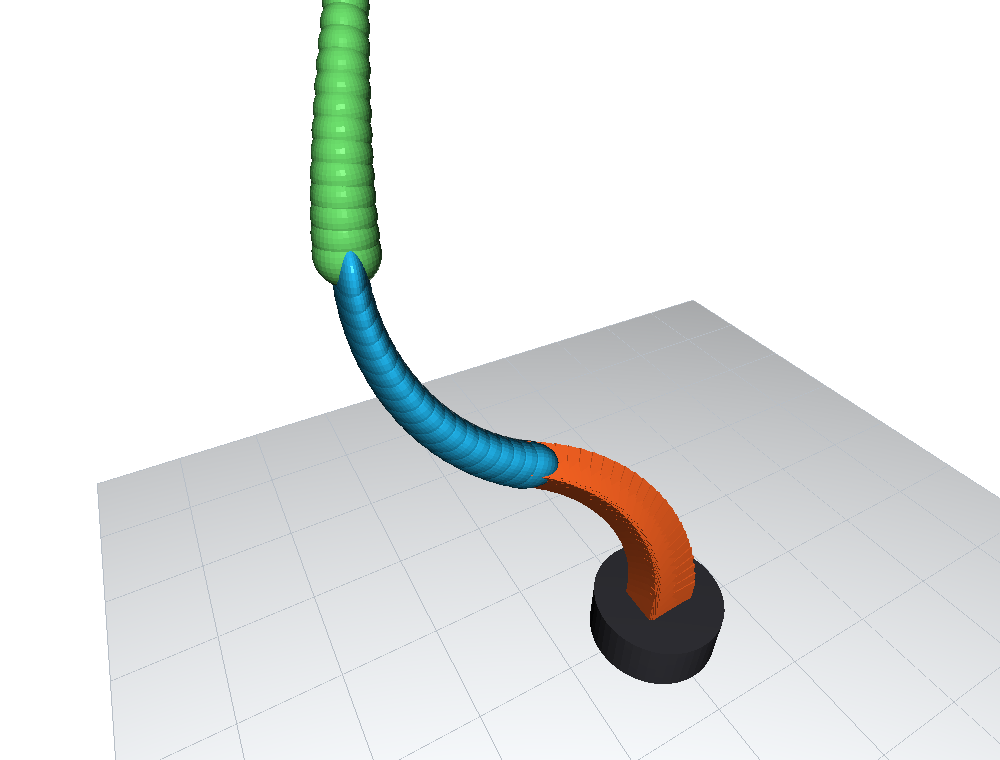
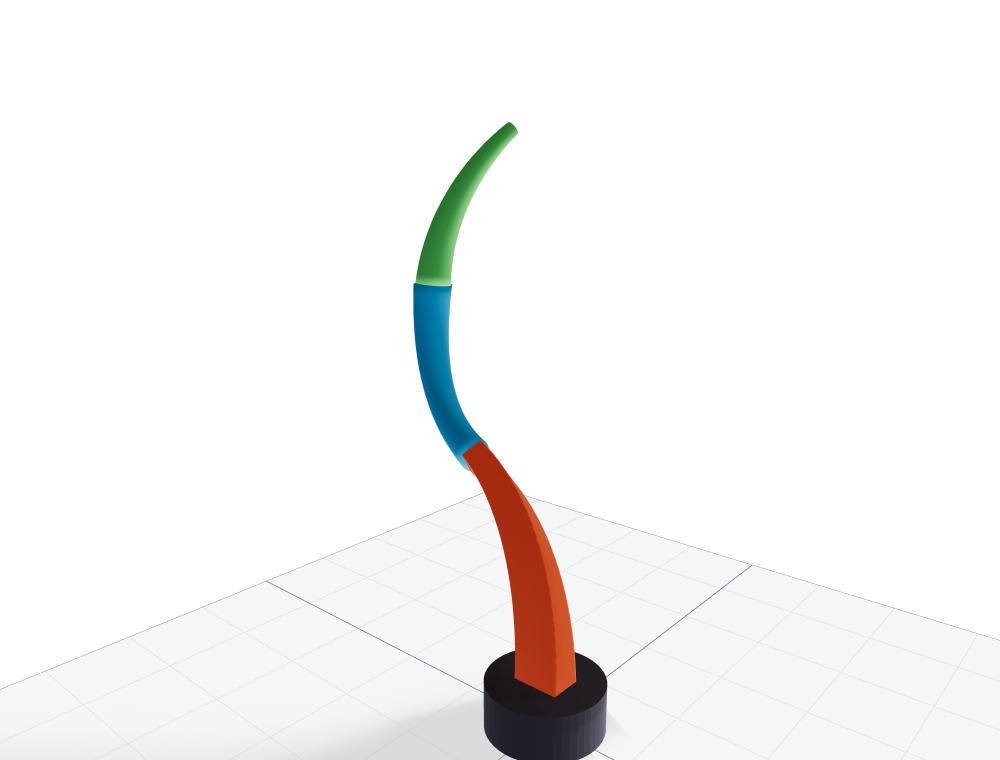
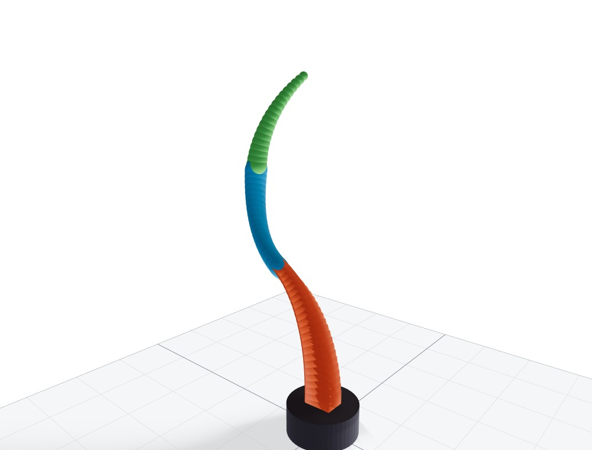

# Renderer API

API reference for SoRoMoX visualization and rendering backends.

Start with the [Rendering overview](index.md) to compare output and choose a
backend. Camera, color, base, ground-plane, multi-robot, and recording options
are documented under [Shared Configuration](configuration.md).

## Shared Renderer Contract

All renderers inherit from `BaseSoftRobotRenderer`, which provides cached
forward kinematics, backbone sampling, color resolution, and a common interface
for individual and batched robot configurations.

```text
BaseSoftRobotRenderer (abstract base)
├── MatplotlibRenderer         # Generic 2D and 3D plots
├── Open3DRenderer             # Interactive 3D visualization
├── ViserRenderer              # Browser-based interactive 3D visualization
├── OpenCVPlanarRenderer       # Fast planar rendering
└── OpenCVPlanarHSARenderer    # Planar HSA-specific rendering
```

| API | Shared behavior | Availability |
| --- | --- | --- |
| `BaseSoftRobotRenderer` | Backbone sampling, cached forward kinematics, batched layouts, color resolution, and the common rendering interface | All renderers |
| Robot base | `fixed_base_pose` mounts fixed robots; floating renderers follow the base coordinates in each runtime configuration | All renderers |
| Base plate | `base_plate_radius_scale` and `base_plate_thickness` configure the base geometry | Open3D and Viser; Matplotlib draws a lightweight base marker |
| Ground plane | `show_ground_plane` and `ground_plane_size` configure a base-aligned reference plane; its colors come from `RendererColorConfig` | Matplotlib, Open3D, and Viser |

### Swept Cross-Sections

Open3D and Viser share the same renderer-neutral contour and loft construction.
This contour-based surface construction applies only to
`backbone_style="swept"`. Discrete mode renders independent 3D markers: spheres
for circular sections, boxes for rectangular sections, and ellipsoids for
elliptical sections. It does not construct a continuous cross-sectional surface
or use registered contour builders.

In swept mode, both backends evaluate `robot.cross_section_geometry(q, s)` at
every backbone point and connect the two endpoint contours of each surface
segment. Circular, elliptical, and rectangular sections therefore retain their
actual shape, including dimensions that vary with abscissa such as
`LinearProfile` tapers.

Each link owns its base and tip contour. Internal boundaries therefore use two
one-sided backbone stations at the same physical interface, and the renderers
do not loft across links. This preserves an intentional discontinuity, such as
a rectangular link followed by a circular link, instead of drawing a short
shape-morphing funnel. Both sides of such an interface are capped. Swept mode
requires `num_points` to provide at least two stations per link.

`num_points` controls the longitudinal discretization: it is the number of
markers in discrete mode and the number of backbone stations used to form
link-local surface segments in swept mode. `cross_section_resolution` controls
the transverse discretization around each swept contour. It has no effect in
discrete mode. Rectangles remain piecewise-linear contours with explicit
corners; increasing the cross-section resolution only adds points along their
straight edges. Additional geometry families can be enabled for both swept
renderers with `register_cross_section_contour(...)`, whose builder returns an
ordered, implicitly closed material-frame contour.

The frames below show the same deformed three-link GVS robot in both backends.
Its rectangular base link tapers linearly in height, its elliptical middle link
combines a constant semi-major axis with a linearly varying semi-minor axis, and
its circular tip link tapers linearly in radius.

| Backend | Swept surface | Discrete markers |
| --- | --- | --- |
| Open3D |  |  |
| Viser |  |  |

::: soromox.rendering.cross_sections
    options:
      show_root_heading: true
      show_source: false
      heading_level: 4
      docstring_section_style: table
      members_order: source

### Actuator and Helper Geometry

For `SoftRobot` systems, the rendering layer automatically adapts supported
installed actuators and passive elements into semantic geometry when
`render_actuators=True`. The adapter returns one or more `ActuatorVisualLayer`
objects with points shaped
`(num_actuators_in_layer, num_points, dim)`. It is also available directly as
`soromox.rendering.actuator_visual_layers(...)`.

Specialized or third-party robots may override this default by exposing
`actuator_visual_layers(q, s_points, *, actuator_inputs=None)`.

For batches and trajectories, robots may additionally provide
`actuator_visual_layers_batched(...)` or
`actuator_visual_layers_trajectory(...)`. The base renderer uses these hooks
when available and otherwise falls back to the generic adapter or the
single-configuration custom hook.

Open3D and Viser also accept helper spheres through
`static_spheres_positions`, `static_spheres_radii`, and
`static_spheres_colors`. Their sequence renderers additionally support the
corresponding `dynamic_spheres_*` arguments.

## Base Class

::: soromox.rendering.base.BaseSoftRobotRenderer
    options:
      show_root_heading: true
      show_source: false
      heading_level: 3
      docstring_section_style: table
      members_order: source

## Matplotlib Renderer

`MatplotlibRenderer` provides static figures, notebook-friendly inspection,
slider-based playback, and ordinary animations for planar and spatial robots.
Spatial configurations use a 3D axes view controlled by `CameraConfig`.

::: soromox.rendering.matplotlib_renderer.MatplotlibRenderer
    options:
      show_root_heading: true
      show_source: false
      heading_level: 3
      docstring_section_style: table
      members_order: source

## Open3D Renderer

`Open3DRenderer` provides interactive spatial visualization with mesh geometry,
camera controls, playback, screenshots, and offline frame or video capture.
Open3D currently requires Python 3.12 or earlier because Python 3.13 wheels are
not yet available.

Set `backbone_style="discrete"` for per-point markers or `"swept"` for a
material-frame surface lofted from the robot's cross-section contours.
Multi-robot sequence scenes automatically merge each robot's backbone
primitives to reduce Open3D registrations; `merge_backbone_meshes` can force or
disable this behavior when measuring a particular workload.

### Keyboard Controls

| Key | Action |
| --- | --- |
| `Space` | Play or pause |
| `→` / `←` | Step to the next or previous frame |
| `H` | Go to the first frame |
| `S` | Save a snapshot |
| `R` | Reset the camera |
| `C` | Capture camera parameters |
| `L` | Load camera parameters |
| `V` | Print camera parameters |
| `Q` / `Esc` | Quit |

::: soromox.rendering.open3d_renderer.Open3DRenderer
    options:
      show_root_heading: true
      show_source: false
      heading_level: 3
      docstring_section_style: table
      members_order: source

### References

Zhou, Q. Y., Park, J., & Koltun, V. (2018). Open3D: A modern library for 3D
data processing. *arXiv preprint arXiv:1801.09847*.

[Open3D documentation](http://www.open3d.org/docs/)

## Viser Renderer

`ViserRenderer` provides browser-based spatial visualization with live state
streaming, playback controls, multi-robot scenes, lighting, helper geometry,
plot panels, and synchronized video or snapshot capture. As with Open3D,
`backbone_style` selects discrete or swept robot geometry.

### GUI Plots and Live Mode

`ViserRenderer.render_sequence()` can add Plotly panels with:

- `plot_configurations=True`
- `plot_actuator_positions=True`
- `custom_plots={"My Plot": (figure, aspect)}`

Plot panels require Plotly and a single trajectory with shape `(T, DOF)`.
Live visualization is available through `start_live_mode()`, either with a
callback that supplies states or by pushing states to the returned controller.

### Visual Quality

Viser exposes backend-specific controls for:

- lighting through `enable_default_lights`, directional-light, and
  ambient-light parameters;
- materials through `material`, `flat_shading`, and `wireframe`;
- mesh quality through `sphere_resolution` and `cross_section_resolution`;
- shadows through `cast_shadows`, `backbone_cast_shadow`, and
  `sphere_cast_shadow`.

::: soromox.rendering.viser_renderer.ViserRenderer
    options:
      show_root_heading: true
      show_source: false
      heading_level: 3
      docstring_section_style: table
      members_order: source

### References

Yi, B., Kim, C. M., Kerr, J., Wu, G., Feng, R., Zhang, A., Kulhanek, J., Choi,
H., Ma, Y., Tancik, M., & Kanazawa, A. (2025). Viser: Imperative, Web-based 3D
Visualization in Python. *arXiv preprint arXiv:2507.22885*.

- [arXiv paper](https://arxiv.org/abs/2507.22885)
- [Viser GitHub repository](https://github.com/nerfstudio-project/viser)

## OpenCV Planar Renderer

`OpenCVPlanarRenderer` provides lightweight single-frame rendering and fast
video export for planar robots.

::: soromox.rendering.opencv_planar_renderer.OpenCVPlanarRenderer
    options:
      show_root_heading: true
      show_source: false
      heading_level: 3
      docstring_section_style: table
      members_order: source

## OpenCV Planar HSA Renderer

`OpenCVPlanarHSARenderer` extends the planar OpenCV backend with HSA-specific
geometry. Its system-level usage is documented with the
[Planar HSA model](../systems/pcs/planar-hsa.md).

::: soromox.rendering.planar_hsa.opencv_renderer.OpenCVPlanarHSARenderer
    options:
      show_root_heading: true
      show_source: false
      heading_level: 3
      docstring_section_style: table
      members_order: source
