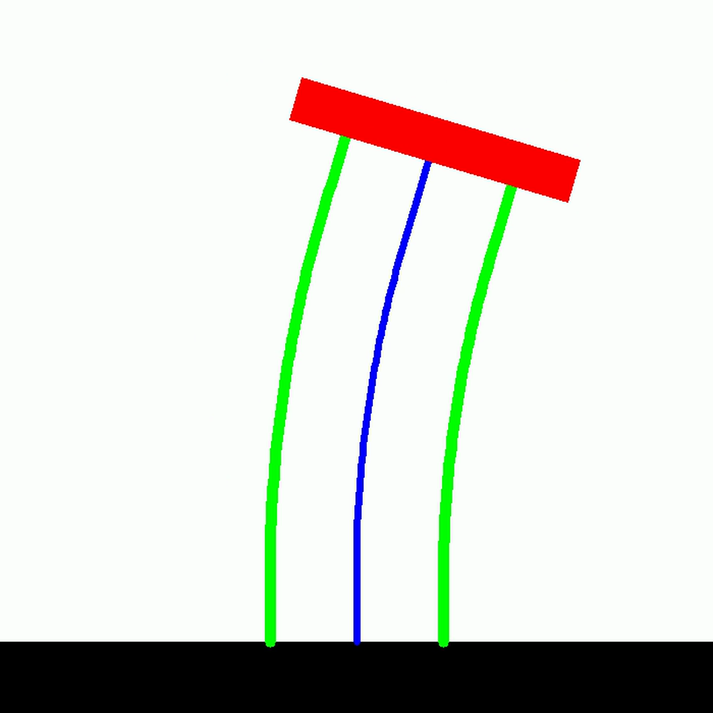

# Planar HSA Systems

The Planar Handed Shearing Auxetics (HSA) systems provide implementations for soft robots with auxetic properties in planar settings.

## Overview

HSA robots exhibit unique mechanical properties due to their auxetic structure, which allows for interesting deformation patterns and control strategies. This module implements the kinematic and dynamic models for planar HSA robots.

<figure markdown>
  { .soromox-figure }
  <figcaption>The specialized OpenCV renderer preserves the HSA platform and rod geometry in fast planar output.</figcaption>
</figure>

## API Reference

::: soromox.systems.hsa.planar_hsa
    options:
      show_root_heading: true
      show_source: false
      heading_level: 3
      group_by_category: true
      docstring_section_style: table
      members_order: source
