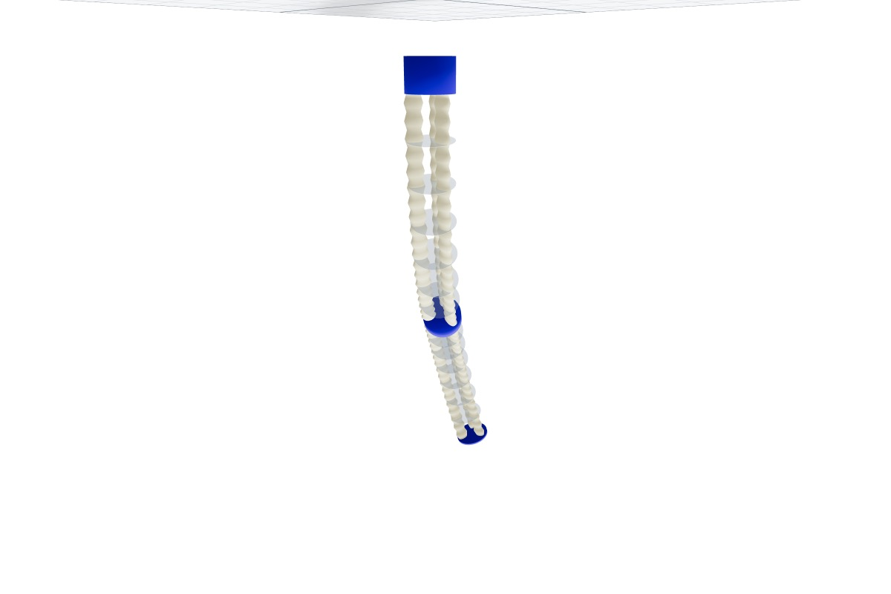

# I-Support

3D pneumatically actuated soft robot based on the I-Support platform.

## Overview

`ISupport` is a specialized PCS implementation for 3D pneumatic soft robots.
Its pressure chambers use the common threadlike-actuation model: each physical
chamber is represented by a straight, segment-local equivalent path through the
deformable pneumatic section.

- **3 chambers per segment**: Radially arranged pneumatic chambers
- **Pressure-based control**: Direct pressure input for actuation
- **I-Support platform**: Specific configuration for the I-Support robot

<figure markdown>
  { .soromox-figure }
  <figcaption>I-SUPPORT Viser rendering with corrugated pneumatic chambers, spacers, and rigid interfaces.</figcaption>
</figure>

## Specialized Viser Rendering

Use `ISupportViserRenderer` to display the physical chamber layout instead of
the generic swept backbone. The renderer follows the model's chamber radii,
radial distances, angle offsets, pneumatic-segment grouping, and rigid connector
topology. It adds corrugated chamber surfaces, six translucent spacers per
pneumatic segment, and the base, intermediate, and tip interfaces.

```python
from soromox.rendering import ISupportViserRenderer, ISupportVisualConfig

renderer = ISupportViserRenderer(
    robot,
    visual_config=ISupportVisualConfig(),
    num_points=50,
)
renderer.show(q)
```

`ISupportVisualConfig` exposes spacer thickness, chamber ellipticity, bellows
pitch and amplitude, mesh resolution, colors, and spacer opacity. Rigid
segments and pneumatic-section spacers use their modeled radii; no visual-only
connector slots are added.

Pass chamber pressures in pascals to color each chamber with the sequential
Matplotlib `Blues` colormap. The default scale spans 0–300 kPa and omits the
palest 15% of the colormap so unpressurized chambers remain visible. Values
outside the configured scale are clamped. Pressure channels use segment-major
order: all chamber azimuth indices of the first pneumatic segment, followed by
those of the second segment, and so on.

The `pressure_range` configuration is expressed in pascals, matching the
model and pressure input API. Conversion to kPa happens only for sidebar and
label presentation.

```python
pressures = jnp.array([2.0e4, 0.0, 0.0])
renderer.show(q, pressures=pressures)
```

Interactive views color the chambers whenever pressures are supplied. Pressure
text starts hidden and can be enabled with the **Show pressure labels** sidebar
checkbox. Labels use one-based model terminology and display values in kPa, for
example `Segment 1 · Chamber 1` and `20.0 kPa`. A captured frame has no
interactive sidebar, so `render_frame(q, pressures=pressures)` includes both
the colors and labels automatically. Omitting `pressures` retains the original
uniform chamber appearance and renders no pressure text.

For trajectories, `pressures` may be a constant `(num_actuators,)` vector, a
`(T, num_actuators)` time series, or a batched
`(N, T, num_actuators)` time series:

```python
renderer.render_sequence(ts, q_ts, pressures=pressure_ts)
```

The live controller accepts synchronized updates through
`push_state_with_pressures(q, pressures)`, a separate `pressure_callback`, or a
state callback that returns `(q, pressures)`.

## Model Quick Start

```python
import jax.numpy as jnp
from soromox.systems import ISupport, ISupportParams, ISupportStructure

params = ISupportParams(
    # Physical order: rigid base, pneumatic section, rigid tip.
    length=jnp.array([0.01, 0.18, 0.01]),
    radius=jnp.array([0.03, 35.6e-3, 0.025]),
    density=jnp.array([1210.0, 1104.0, 1210.0]),
    young_modulus=jnp.array([2.0e9, 1.6464e6, 2.0e9]),
    shear_modulus=jnp.array([0.8e9, 0.5488e6, 0.8e9]),
    material_damping_coefficient=1.96e3,
    reference_strain=jnp.tile(
        jnp.array([0.0, 0.0, 0.0, 1.0, 0.0, 0.0]), 3
    ),
    chamber_inner_radius=jnp.array([6.39e-3]),
    chamber_outer_radius=jnp.array([7.79e-3]),
    chamber_distance=jnp.array([20e-3]),
    chamber_azimuth_angles=(2.0 * jnp.pi * jnp.arange(3) / 3)[None, :],
)
robot = ISupport(
    params,
    structure=ISupportStructure(
        num_gauss_points=3,
        rigid_segment_selector=(True, False, True),
    ),
)

q = jnp.zeros(robot.num_dofs)

# Pressure actuation (3 chambers per pneumatic segment)
u = jnp.array([2.0e4, 0.0, 0.0])

# Forward kinematics
g_tip = robot.forward_kinematics(q, s=jnp.sum(robot.L))
```

## Key Features

### Chamber Configuration

The I-Support robot uses 3 pneumatic chambers per segment, arranged radially at 120-degree intervals. This configuration enables:

`chamber_azimuth_angles` has shape
`(num_pneumatic_segments, num_chambers_per_segment)`. Azimuth is a
right-handed rotation about local `+X`, measured in radians from local `+Y`
toward local `+Z`, so a chamber center is
`[0, d*cos(phi), d*sin(phi)]`. Entry `j` is pressure channel `j`; the model
does not sort or generate angles. Each row may be rotated, wrapped, and listed
in any channel order, but its wrapped circular gaps must be uniformly
`2*pi/num_chambers_per_segment` (within `rtol=1e-6`, `atol=1e-8`). Asymmetric
layouts are currently rejected because the passive cross-section model assumes
rotational symmetry.

If `chamber_azimuth_angles` is omitted, `ISupport` supplies the canonical
three-chamber layout `[0, 2*pi/3, 4*pi/3]`, or `[0°, 120°, 240°]`, for every
pneumatic segment. Pass an explicit array whenever physical pressure-channel
order differs from that default.

- Bending in any direction
- Extension/compression along the backbone
- Complex 3D deformations

### Actuation Mapping

Pressure remains the user control and is measured in pascals. The work
coordinate of chamber `k` is the equivalent chamber volume

```text
V_k(q) = A_eff,k * length_k(q),
```

so the pressure actuation matrix is

```text
A(q) = (dV/dq)^T = (d length/dq)^T diag(A_eff).
```

This is the same distributed virtual-path model introduced in PR #116, now
expressed through `ThreadlikeActuator.pressure_chambers(...)`. It is
configuration-dependent and integrates the path contribution along every PCS
child belonging to the physical pneumatic section. A chamber never crosses a
rigid connector or contributes to another pneumatic section.

`chamber_effective_pressure_area` has one entry per physical pneumatic section
and is shared by its pressure channels. If omitted, the model uses the annular
area

```text
A_eff = pi * (chamber_outer_radius**2 - chamber_inner_radius**2).
```

The pressure-conjugate coordinates, velocities, efforts, moment matrix, and
generalized force use the shared actuation interface:

```python
volumes = robot.actuator_coordinates(q)
volume_rates = robot.actuator_velocities(q, qd)
pressure_efforts = robot.actuator_efforts(q, pressures, qd=qd)
A = robot.actuation_matrix(q)
tau = robot.actuation_force(q, pressures, qd=qd)
```

For the current `DirectEffort` model, `pressure_efforts == pressures`. The
effective area is part of the transmission coordinate and moment matrix rather
than a separate pressure-to-force conversion API.

I-SUPPORT's specialized renderer continues to draw the detailed bellows and
accepts `actuator_inputs=` (with `pressures=` as a mutually exclusive alias).
The internal equivalent paths are not drawn as generic pneumatic tubes.

## API Reference

::: soromox.systems.pcs.isupport.ISupport
    options:
      show_root_heading: true
      show_source: false
      heading_level: 3
      group_by_category: true
      docstring_section_style: table
      members_order: source

## References

Key literature on the I-SUPPORT platform and its dynamic modeling:

- Arleo, L., Stano, G., Percoco, G., & Cianchetti, M. (2021). I-support soft
  arm for assistance tasks: a new manufacturing approach based on 3D printing
  and characterization. *Progress in Additive Manufacturing*, 6(2), 243–256.
  [https://doi.org/10.1007/s40964-020-00158-y](https://doi.org/10.1007/s40964-020-00158-y)
- Alessi, C., Falotico, E., & Lucantonio, A. (2023). Ablation study of a
  dynamic model for a 3D-printed pneumatic soft robotic arm. *IEEE Access*,
  11, 37840–37853.
  [https://doi.org/10.1109/ACCESS.2023.3266282](https://doi.org/10.1109/ACCESS.2023.3266282)
- Alessi, C., Bianchi, D., Stano, G., Cianchetti, M., & Falotico, E. (2024).
  Pushing with soft robotic arms via deep reinforcement learning. *Advanced
  Intelligent Systems*, 6(8), 2300899.
  [https://doi.org/10.1002/aisy.202300899](https://doi.org/10.1002/aisy.202300899)
