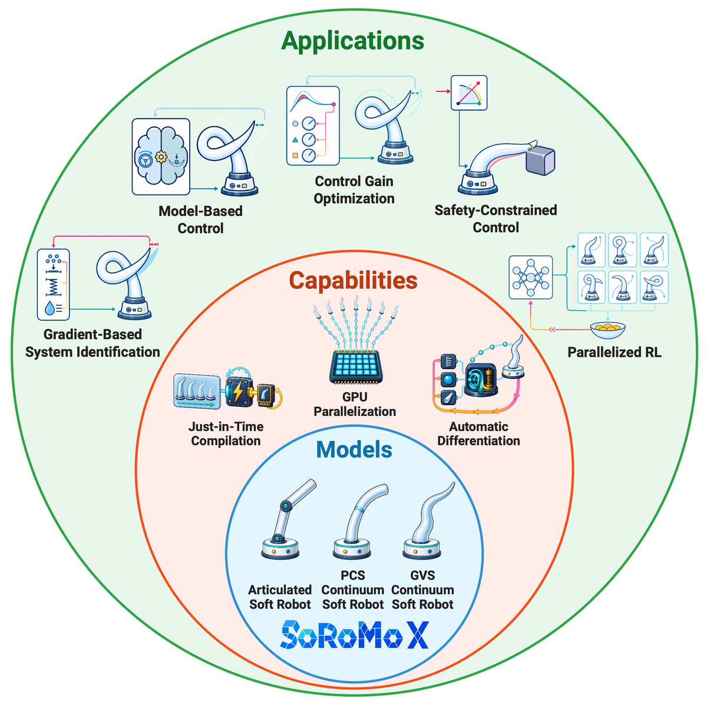

<div align="center">
  
</div>

# Soft Robot Models in jaX (SoRoMoX)

SoRoMoX is a fully numerical, JIT-compilable Python/JAX implementation of
control-oriented models for articulated and continuum soft robots. It provides
articulated soft-robot, piecewise-constant strain (PCS), and geometric variable
strain (GVS) models through a shared interface for kinematics, dynamics,
energies, Jacobians and derivatives, and forward dynamics.

!!! info "Successor to JSRM"

    SoRoMoX succeeds
    [JSRM](https://github.com/tud-phi/jax-soft-robot-modeling). It replaces
    symbolic derivations with scalable numerical implementations and extends
    the architecture to articulated, PCS, and GVS model families with common
    control and rendering interfaces.

<figure markdown>
  { .soromox-figure .soromox-figure--overview .soromox-figure--transparent }
  <figcaption>SoRoMoX places control-oriented soft-robot models in the JAX computational stack.</figcaption>
</figure>

<div class="grid cards" markdown>

-   :material-robot: **Soft robot model implementations**

    Articulated soft-robot models, planar and spatial PCS models, and spatial
    GVS models, with several actuation modalities and example robot
    instantiations.

    [Explore the systems :octicons-arrow-right-24:](api/systems/index.md)

-   :material-speedometer: **JAX-native numerical core**

    JIT compilation, automatic differentiation with respect to states, inputs,
    and parameters, vectorization, and CPU/GPU/TPU execution.

    [Read the paper results :octicons-arrow-right-24:](research.md)

-   :material-function-variant: **Control-oriented interface**

    Kinematics, Jacobians, inertia and force terms, energies, actuation maps,
    and fused forward dynamics through consistent model contracts.

    [Browse the API :octicons-arrow-right-24:](api/overview.md)

-   :material-toolbox-outline: **Model-based control**

    Configuration-, operational-, and actuation-space controller
    implementations complement the model layer, including potential
    compensation, computed-torque, and impedance controllers.

    [Explore model-based control :octicons-arrow-right-24:](api/control/index.md)

-   :material-image-multiple-outline: **Rendering**

    Matplotlib, Open3D, Viser, and OpenCV renderers support static figures,
    interactive 3D visualization, real-time planar rendering, and video export.

    [View the renderer gallery :octicons-arrow-right-24:](api/rendering/index.md)

</div>

## Get started

Install the core package from PyPI:

```bash
python -m pip install soromox
```

Add the rendering backends and run an example:

```bash
python -m pip install "soromox[rendering,examples]"
python examples/simulation/pcs/simulate_planar_pcs.py
```

The [Installation](installation.md) page explains optional extras and source
installs. The [Quick Start](user-guide/quick-start.md) walks through model
construction, simulation, control, and visualization.

## Paper and application case studies

The accompanying paper benchmarks SoRoMoX's model implementations. Its six
application case studies demonstrate how control-oriented quantities,
differentiability, and parallel execution support system identification,
learning, and control.

- [Paper & Results](research.md) presents the benchmarks, all six application
  case studies, visual demonstrations, and reproduction pointers.
- [Citation](citation.md) provides the recommended paper BibTeX and
  exact-version software citation.

## Choose your next step

- [Examples](user-guide/examples.md) for complete simulation and control
  workflows.
- [API Reference](api/overview.md) for systems, control, rendering, actuation,
  and utilities.
- [Contributing](development/contributing.md) for development setup and project
  conventions.

## Citation

If you use SoRoMoX in academic work, please cite
**[“SoRoMoX: Fast, Differentiable, and Parallelizable Soft Robot Models”](https://arxiv.org/abs/2608.06650)**.
The [Citation](citation.md) page provides copy-ready BibTeX and guidance for
reporting the exact software version.

## License

SoRoMoX is distributed under the
[MIT License](https://github.com/tud-phi/soromox/blob/main/LICENSE.txt).
