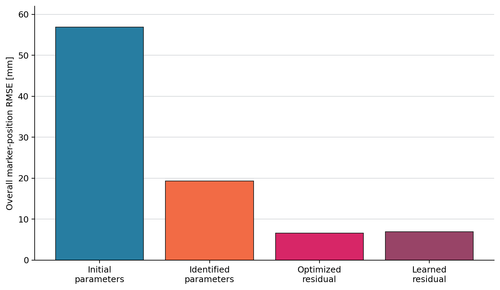
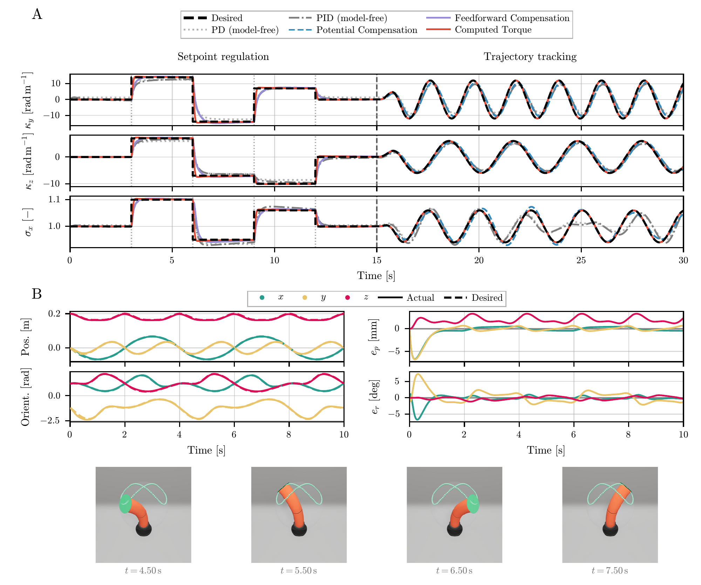
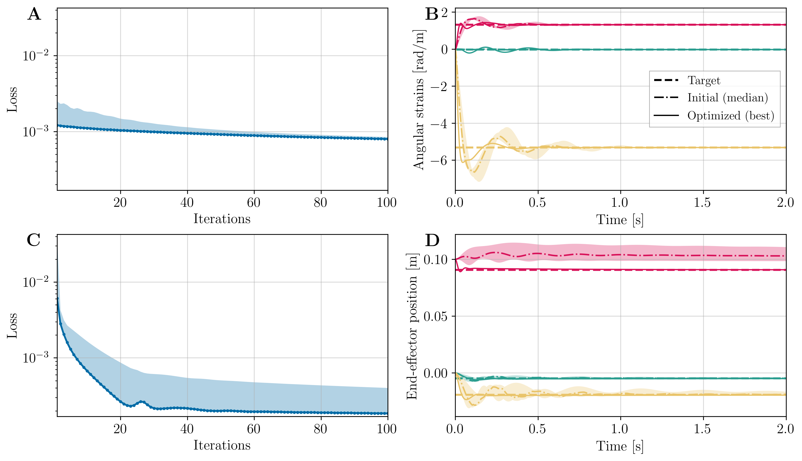

# Paper & Results

SoRoMoX is presented in
**[“SoRoMoX: Fast, Differentiable, and Parallelizable Soft Robot Models”](https://arxiv.org/abs/2608.06650)**.

!!! quote "Using SoRoMoX in research?"

    The [Citation](citation.md) guide provides the recommended paper
    BibTeX, an exact-version software citation, and model- or
    controller-specific references.

## Paper overview

The paper's primary contribution is a fully numerical, JIT-compilable
Python/JAX implementation of control-oriented models for articulated and
continuum soft robots. SoRoMoX implements articulated soft-robot,
piecewise-constant strain (PCS), and geometric variable strain (GVS) models
through one interface for kinematics, dynamics, energies, Jacobians and
derivatives, actuation maps, and forward dynamics.

Because the numerical core is JAX-native, these model computations can be
JIT-compiled, automatically differentiated with respect to states, inputs, and
physical parameters, vectorized, and executed on CPUs, GPUs, and TPUs.
Model-based controllers and rendering backends are supporting contributions
built around this model layer.

<figure markdown>
  { .soromox-figure .soromox-figure--overview .soromox-figure--transparent }
  <figcaption>SoRoMoX brings control-oriented articulated, PCS, and GVS models into the JAX computational stack.</figcaption>
</figure>

## Model evaluation

### Sequential CPU rollouts

The paper reports wall-clock time for three seconds of simulated motion. The
table below retains the matched PCS and GVS comparison with SoRoSim:

| Formulation | Case | SoRoSim (s) | SoRoMoX (s) | Speedup |
| --- | --- | ---: | ---: | ---: |
| FEM/PCS | Planar | 75.73 | 4.18 | 18.1× |
| FEM/PCS | Spatial | 78.65 | 13.26 | 5.9× |
| FEM/GVS | Spatial | 55.54 | 36.33 | 1.5× |
| FEM/GVS | Tendons | 75.80 | 36.47 | 2.1× |

### Batched GPU rollouts

<figure markdown>
  { .soromox-figure .soromox-figure--plot }
  <figcaption>On the reported RTX 5090 benchmark, scaling the leading batch size from 1 to 256 yields up to 234.6× higher simulation throughput.</figcaption>
</figure>

The exact scaling depends on the model, number of links or segments, hardware,
and discretization. Under the paper's settings, the articulated models show the
strongest scaling, while the more expensive spatial PCS and GVS models still
benefit substantially from batching.

## Application case studies

<figure markdown>
  { .soromox-figure .soromox-figure--overview }
  <figcaption>The six application case studies reported in the paper.</figcaption>
</figure>

### 1. Static-equilibrium system identification

This study differentiates through a two-link GVS model to identify Young's
modulus, Poisson's ratio, and mass density from static marker measurements of a
conical tendon-driven arm. Optimizing the physical parameters reduces the
aggregate marker-position RMSE from 56.9 mm to 19.3 mm, an improvement of about
66%.

### 2. Residual-force learning

Using the same differentiable static-equilibrium model, the study first
estimates input-dependent residual generalized forces and then trains a neural
network to predict them. The optimized and learned residuals reduce the overall
marker RMSE to 6.6 mm and 6.9 mm, respectively.

<figure markdown>
  { .soromox-figure .soromox-figure--compact }
  <figcaption>Shared result from the paper's static-equilibrium identification and residual-learning studies.</figcaption>
</figure>

### 3. Model-based control

This study exercises the quantities exposed by the common model interface. A
one-segment spatial PCS robot compares model-free PD/PID control with potential,
feedforward, and computed-torque compensation; a fully actuated two-segment PCS
robot tracks a spherical figure-eight pose trajectory with operational-space
impedance control. The operational-space example reports 2.84 mm position RMSE
and 2.29° orientation RMSE.

<figure markdown>
  { .soromox-figure .soromox-figure--wide }
  <figcaption>Paper results for configuration-space regulation/tracking and operational-space pose tracking.</figcaption>
</figure>

<video class="soromox-video" controls muted loop playsinline preload="metadata" poster="assets/paper/model-based-control-poster.jpg" aria-label="Operational-space model-based control demonstration">
  <source src="assets/paper/model-based-control.mp4" type="video/mp4">
  Your browser cannot play this video. View the <a href="assets/paper/model-based-control.gif">animated GIF</a> instead.
</video>

### 4. Control-gain optimization

Here, gradients are propagated through full closed-loop rollouts while several
gain initializations are evaluated in parallel. For actuation-space and
operational-space control, the optimized losses decrease by 62% and 57%,
respectively, relative to their initial median values.

<figure markdown>
  { .soromox-figure .soromox-figure--wide }
  <figcaption>Paper results for batched, differentiable control-gain optimization.</figcaption>
</figure>

### 5. Safety-constrained control

The safety study uses differentiable PCS kinematics and dynamics to formulate
high-order control Lyapunov and control barrier function constraints. The
safety-unaware controller reaches about 33.5 N of pairwise normal force. The
HOCBF-constrained controller stays at or below the prescribed 5 N limit while
accepting a larger final goal distance.

<video class="soromox-video" controls muted loop playsinline preload="metadata" poster="assets/paper/safety-constrained-control-poster.jpg" aria-label="Safety-unaware and HOCBF-constrained soft-robot control">
  <source src="assets/paper/safety-constrained-control.mp4" type="video/mp4">
  Your browser cannot play this video. View the <a href="assets/paper/safety-constrained-control.gif">animated GIF</a> instead.
</video>

### 6. Parallel reinforcement learning

The final study vectorizes tendon-driven PCS environments on a GPU for PPO
training. The trained policy reaches a 6.19 mm final mean tracking error and a
91.4% step-wise success rate. The reported 4× and 7× training speedups at 256
and 512 environments relative to the CPU PyElastica baseline jointly reflect
model formulation, JIT compilation, hardware acceleration, and rollout
parallelization.

<video class="soromox-video" controls muted loop playsinline preload="metadata" poster="assets/paper/parallel-rl-poster.jpg" aria-label="Initialized and trained parallel reinforcement-learning policies">
  <source src="assets/paper/parallel-rl.mp4" type="video/mp4">
  Your browser cannot play this video. View the <a href="assets/paper/parallel-rl.gif">animated GIF</a> instead.
</video>

Soromox can roll out many soft-robot environments in parallel, accelerating the
experience collection that dominates reinforcement-learning training. The
animation below visualizes a trained policy acting simultaneously in 64
independently simulated environments.

<video class="soromox-video" controls muted loop playsinline preload="metadata" poster="assets/paper/parallel-rl-trained-64-envs-poster.jpg" aria-label="Trained reinforcement-learning policy in 64 parallel soft-robot environments">
  <source src="assets/paper/parallel-rl-trained-64-envs.mp4" type="video/mp4">
  Your browser cannot play this video. View the <a href="assets/paper/parallel-rl-trained-64-envs.gif">animated GIF</a> instead.
</video>

## Reproducing the results

The [`paper_results/`](https://github.com/tud-phi/soromox/tree/main/paper_results)
directory contains experiment entry points, canonical outputs, and
workflow-specific notes. Install its dependencies from an editable checkout:

```bash
python -m pip install -e ".[paper_results]"
```

Start with the README nearest to the experiment you want to reproduce. Record
the SoRoMoX version, hardware, solver configuration, and random seed with new
results. For package setup, see [Installation](installation.md).

If you publish work based on these models or results, follow the
[Citation](citation.md) guide.
