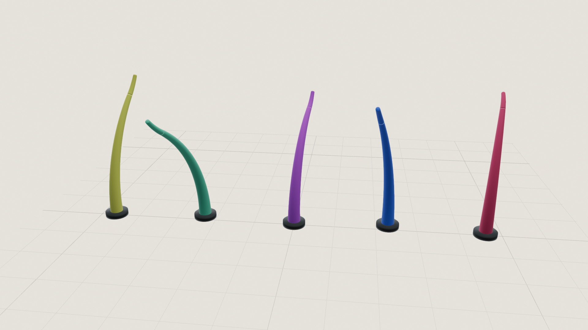
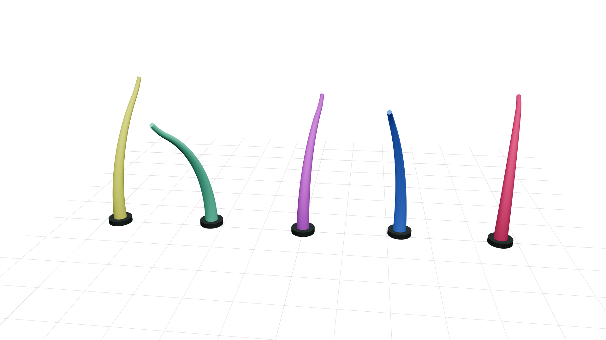
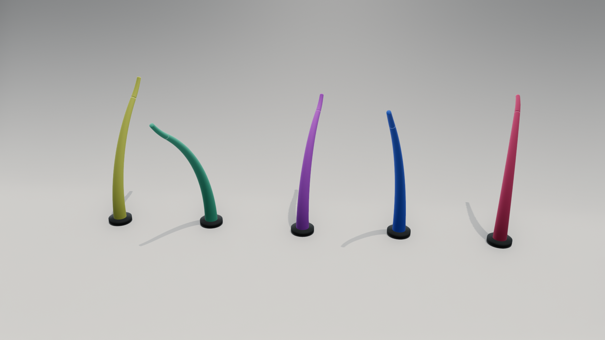
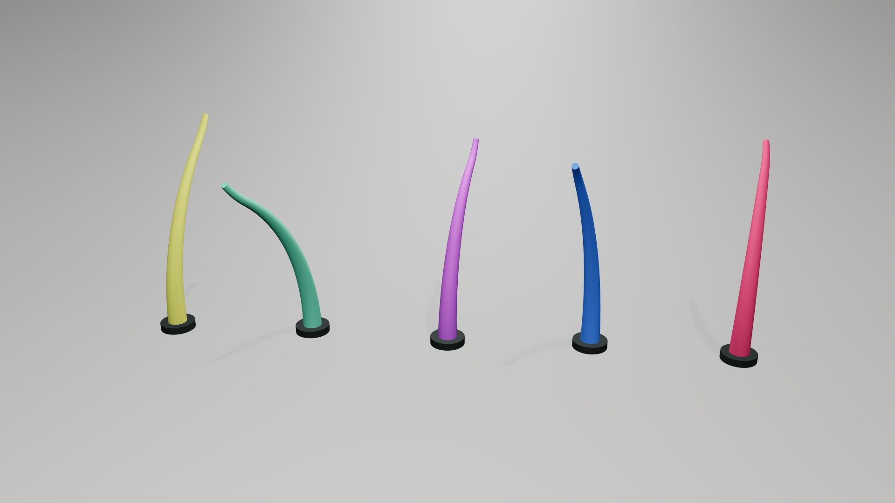
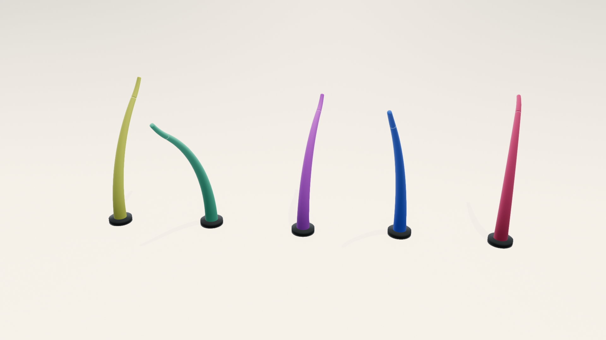
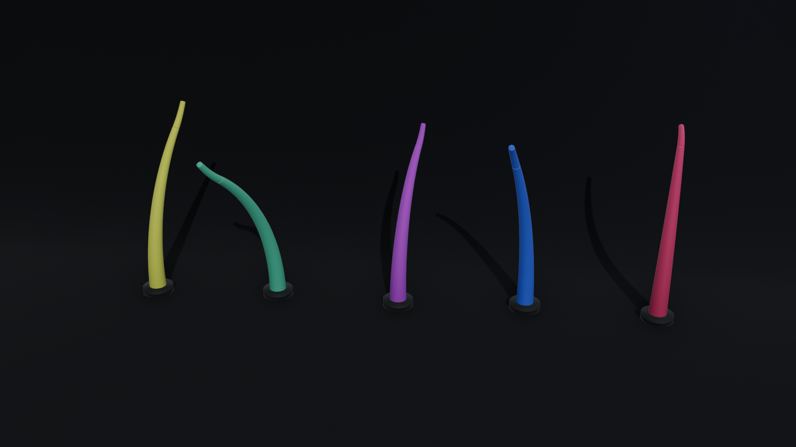
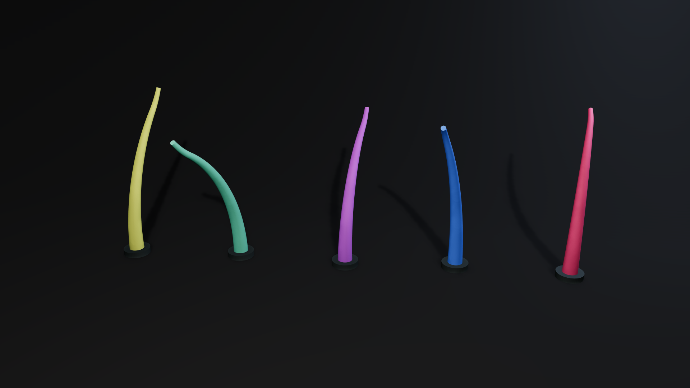
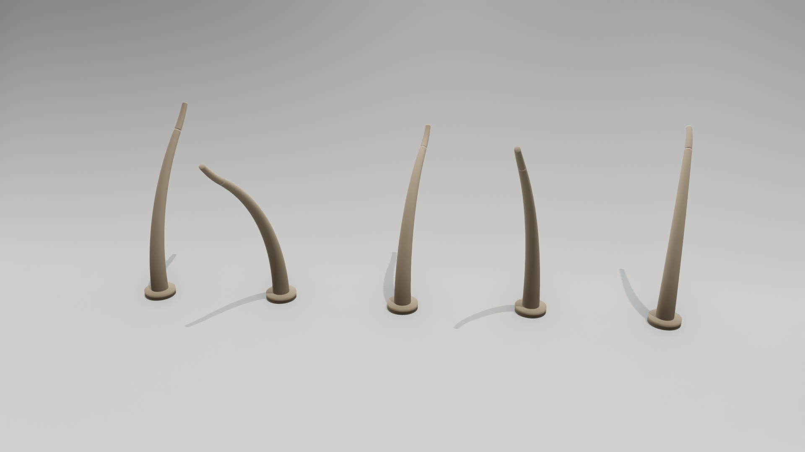
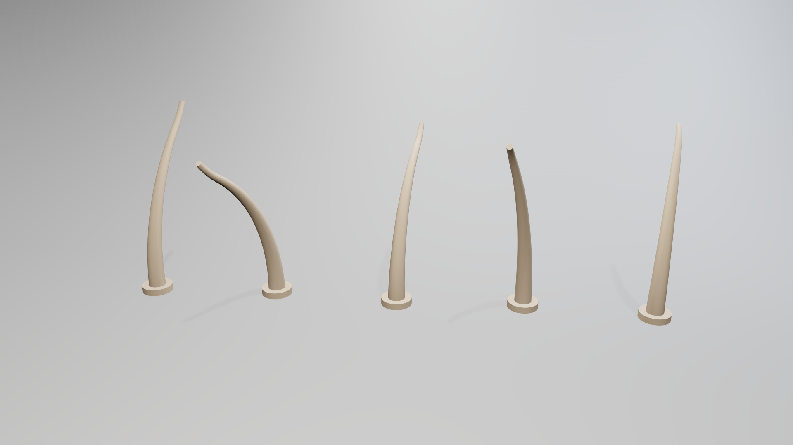

# Renderer preset gallery

The images below use identical soft tentacle geometry, poses and camera settings. Generate them with `preset_gallery.py`; each image is 1920 × 1080.

| Preset | Open3D | Viser | Appearance |
| --- | --- | --- | --- |
| **Technical** |  |  | Both use a grid without a filled slab, anchored to world coordinates with major/minor lines. Balanced fill makes the supplied colors readable. Open3D retains a warmer off-white background and softer surface shading; Viser has a white background and stronger highlights. Workbench's outlines and cavity shading are outside this preset. |
| **Neutral** |  |  | A broader curved sweep, neutral key light and point fills give both scenes a light grey floor and darker wall. Viser approximates environment illumination with a hemisphere light, improving the wall/floor transition. Open3D still has a stronger gradient and sharper contact/cast shadows. The reference's reflective bands and area-light reflections are outside the matte target. |
| **Bright** |  |  | Bright backgrounds and subtle grounding shadows follow the stool-and-blocks reference. Viser is closer to neutral white; Open3D's environment gives a warm cast. Robot highlights retain color and shape. The reference's reflective floor is intentionally outside this matte preset. |
| **Dark** |  |  | A stronger frontal key and fill illuminate the colored tentacle surfaces against the charcoal sweep; a cool rim separates their edges. Open3D retains deeper shading than Viser. The lower key angle casts longer shadows toward the backdrop. The reference's glossy, concentrated highlight strips are broader and weaker on these matte robots. |
| **Flat** |  |  | Both renders remove surface-light gradients, shadows and floor context, as in the unlit terrain reference. Open3D preserves the assigned flat colors. Viser's fixed browser tone mapping shifts their saturation and brightness; the adapter warns about this limitation. Shape is communicated by silhouette alone. |
| **Clay** |  |  | Backbones and mounts share one warm-grey matte material. Directional gradients and contact shadows describe form, following the clay character reference. Open3D has stronger contact definition; Viser looks smoother and lighter. Skin scattering, fine sculpted detail and compositing are not simulated. |

All comparisons concern visual properties of different objects, not pixel similarity. Narrow rings at link transitions come from the two-link surface geometry. Directional shadow maps can show bias and edge artifacts; the references often use area lights or more elaborate material and compositing treatments.

The presets were informed by these visual references:

- **Technical**: [Blender Workbench](https://docs.blender.org/manual/en/latest/render/workbench/index.html) · [reference image](https://docs.blender.org/manual/en/latest/_images/render_workbench_introduction_example.png)
- **Neutral**: [Render Blue — Quick Studio](https://superhivemarket.com/products/quick-studio) · [reference image](https://assets.superhivemarket.com/store/productimage/218446/image/414a253868178847f13b8ddf25e6b8e2.png)
- **Bright**: [Studio Krasht — Neutral Lighting Scene](https://studiokrasht.gumroad.com/l/zubql) · [reference image](https://public-files.gumroad.com/spsesjwr0o0fu71b7dhi866vnrbj)
- **Dark**: [GoodBread — Sharp Lights headphones](https://goodbread.co/3d-product-render-animation.html) · [reference image](https://goodbread.co/images/3d-headphones-contrasting-lights.webp)
- **Flat**: [PyVista — Lighting Properties, no lighting](https://docs.pyvista.org/examples/02-plot/lighting_mesh) · [reference image](https://docs.pyvista.org/_images/sphx_glr_lighting_mesh_002.png)
- **Clay**: [Gianluca Squillace / Marmoset — Clay Characters](https://marmoset.co/posts/rendering-high-quality-clay-characters-in-marmoset-toolbag/) · [reference image](https://marmoset.co/wp-content/uploads/2023/07/0_cover.jpg)
