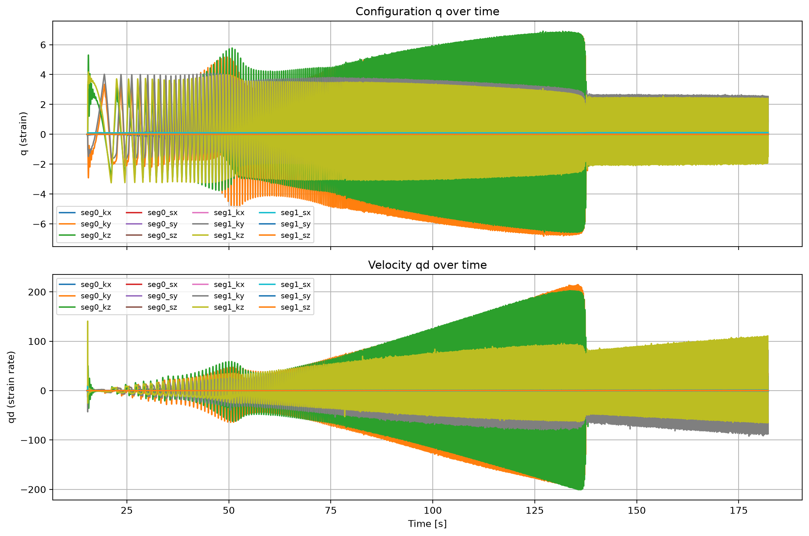
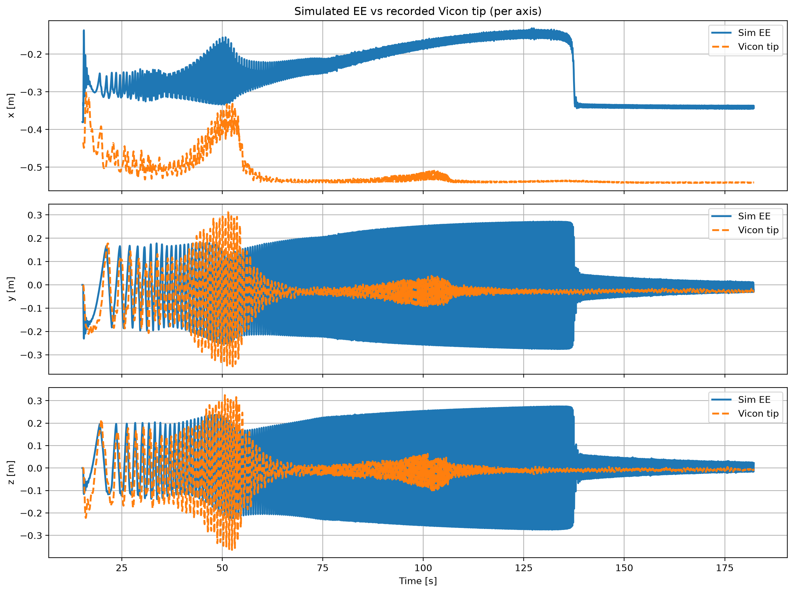
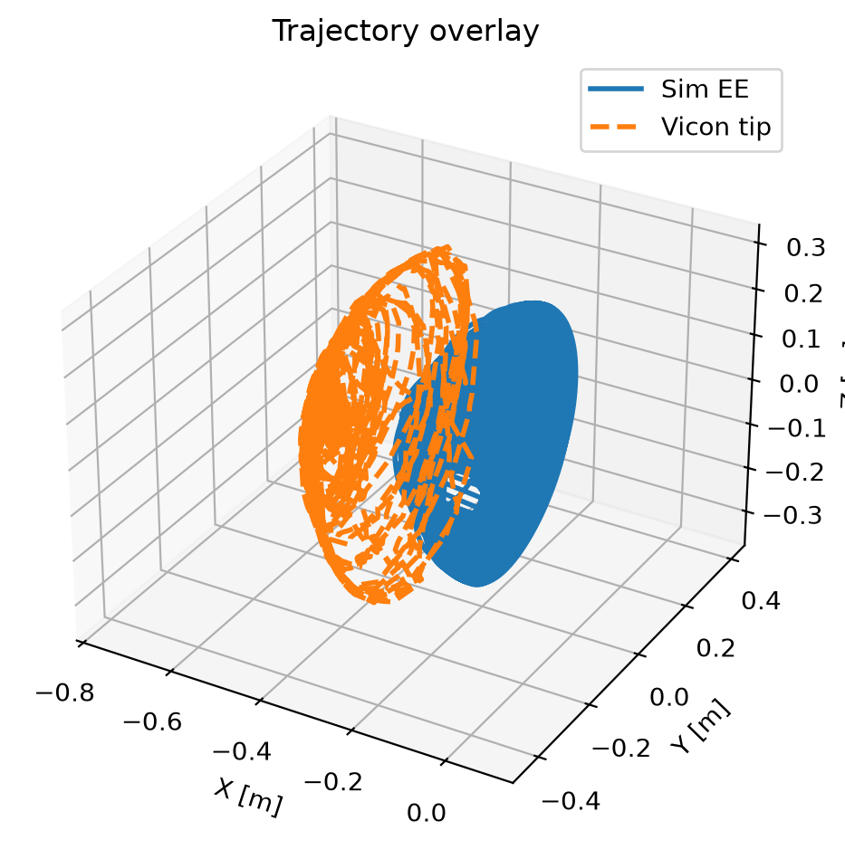
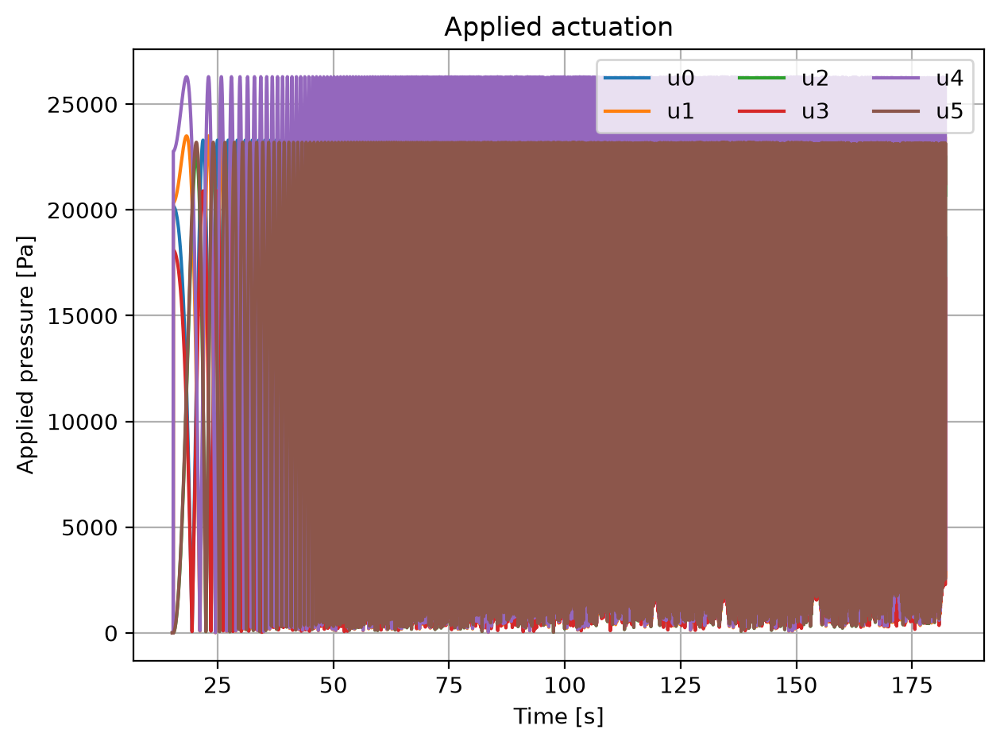
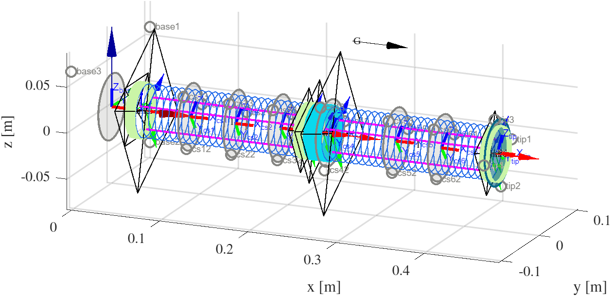
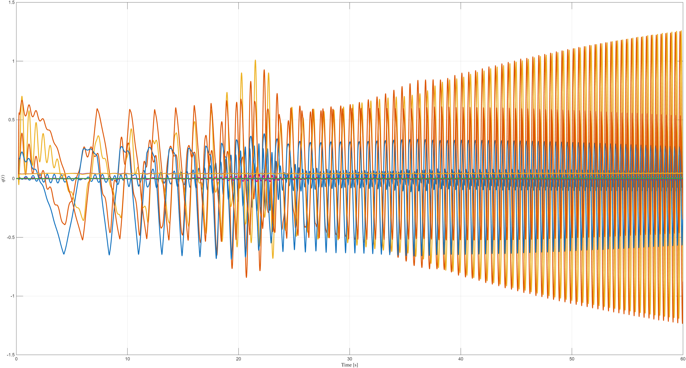
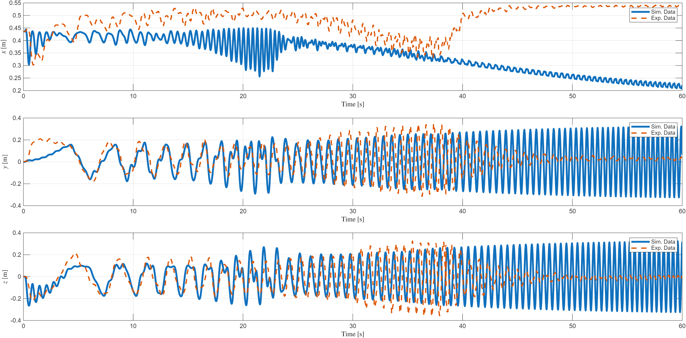
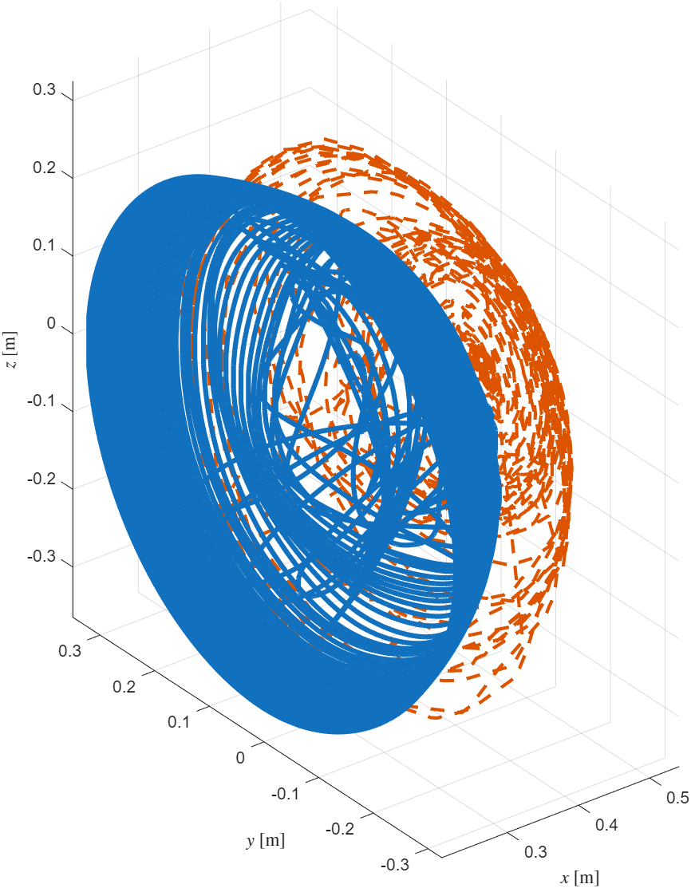

# Task for AM-I Support

This README summarizes the progress on the simulation of the AM-I Support.

## VICON and PCS Robot
Simulate the PCS AM-I Support and compare it with Vicon data. This has been implemented [here](https://github.com/tud-phi/soromox/blob/am_isupport/examples/simulation/pcs/simulate_isupport.py).
Key Advancements:
(i) Implemented adaptive and/or implicit integration.
(ii) Switched to `rollout_closed_loop` to use the input signal \(u(t)\) applied during the experiments.
(iii) Estimation of the Air Leaks.

### Results
**State:**

**Tip Position Comparison:**

**3D Trajectory Comparison:**

**Input Law:**

## VICON and MATLAB
**Rest Configuration:**

**State:**

**Tip Position Comparison:**

**3D Trajectory Comparison:**
